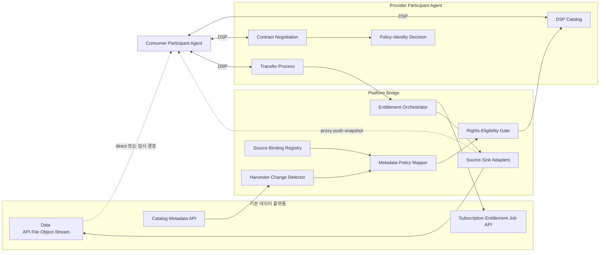
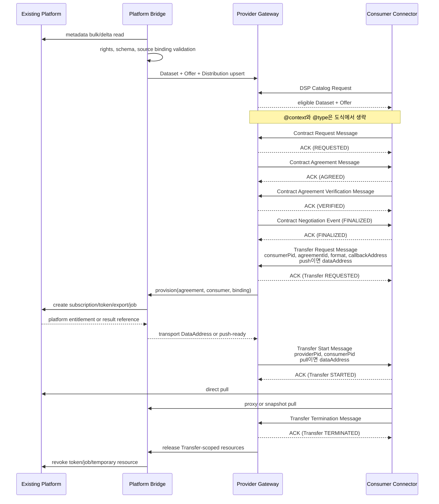

# 기존 데이터 플랫폼과 데이터 스페이스의 연계 패턴

작성일: 2026-07-11  
작성 기준: 2026-07-11  
상태: Draft

## 1. 목적과 적용 범위

- **(목적)** 기존 플랫폼의 기능을 유지하면서 Dataset을 거래 가능한 DSP Offering과 접근 수명주기에 연결
- **(책임 경계)** 기존 플랫폼은 저장·품질관리·API·파일 배포·구독·분석을 계속 담당하고 Platform Bridge는 상태·권리·interface 변환 담당
- **(제외)** Data Lake, Data Hub와 공공 데이터 포털을 DSP 시스템으로 교체하거나 검색 결과 전체를 Full Offering으로 승격
- **(산출물)** 플랫폼 역할별 연계 패턴, Data Plane 선택 조건, source binding과 Offering 수명주기 기준

Platform Bridge가 수행하는 기능은 다음과 같다.

1. 플랫폼의 데이터 상품을 Data Offering으로 선별한다.
2. 플랫폼 metadata를 DSP Catalog가 요구하는 Dataset·Offer·Distribution·DataService로 변환한다.
3. DSP Agreement와 Transfer Process를 플랫폼의 구독, 접근권한, export job, endpoint에 연결한다.
4. 종료·만료·철회 때 플랫폼 자원을 회수한다.

이 문서에서는 이 경계를 **Platform Bridge**라고 부른다. `Platform Bridge`와 `source binding`은 이 프로젝트의 설계 용어다. DSP, DCAT, 국제 데이터 스페이스 협회(International Data Spaces Association, IDSA) 또는 EDC가 동일한 이름의 구성요소를 규정한 것은 아니다.

이 문서의 책임 범위는 연계 선택지와 사례·표준 근거의 비교다. 내부 Offering 상태와 전이는 [Offering 온보딩과 접근 수명주기](../02-architecture/offering-onboarding-lifecycle.md), Bridge 구성요소와 인터페이스 책임은 [Platform-to-Dataspace Bridge](../02-architecture/platform-connector-bridge.md)와 [플랫폼 인터페이스 계약](../02-architecture/platform-interface-contract.md)을 정본으로 삼는다.

### 1.1 Dataset별 플랫폼 역할 판정

기존 플랫폼의 검색 결과를 모두 DSP Offering으로 만들 수는 없다. 데이터셋마다 플랫폼의 역할을 먼저 판정한다.

| 판정 | 플랫폼이 실제로 하는 일 | 가능한 연계 |
| --- | --- | --- |
| `index-only` | 설명과 원천 링크만 검색함 | Discovery-only |
| `hosted` | 파일, API, Object, Stream 또는 Query 결과를 직접 제공함 | Provider Gateway |
| `brokered` | 제3자 데이터를 중개하며 신청·구독·접근권한을 관리함 | Provider Gateway, 단 제공·대행 권한 확인 필요 |
| `unknown` | 역할을 판정할 증거가 부족함 | 근거 확보 전 Full Offering 금지 |

- **(Index-only)** DSP 계약을 이행할 DataService가 없으므로 검색 metadata만 연합
- **(Full Offering 후보)** `hosted` 또는 `brokered`이며 제공 권리와 실행 가능한 endpoint가 확인된 Dataset
- **(판정 단위)** 역할 값은 Dataset과 delivery path별로 하나만 기록하고 플랫폼 전체는 혼합형 허용

## 2. 규격과 설계 결정의 구분

이 문서의 문장을 다음 네 수준으로 읽는다.

| 수준 | 의미 |
| --- | --- |
| DSP 규범 | DSP 2025-1 errata의 `MUST`, `SHOULD`, 상태 머신과 schema |
| 참조 표준 | DCAT 3, ODRL 2.2, DCP 1.0의 정의와 제약 |
| 참조 아키텍처·구현 | DSSC Blueprint, IDS-RAM 4, EDC 문서가 제시하는 패턴 |
| 프로젝트 결정 | 국토교통 연계에서 채택할 내부 상태, source binding, 회수 규칙 |

EDC의 `Asset`, `DataAddress`, `ContractDefinition`, Data Plane extension은 DSP 용어가 아니다. EDC를 사용하지 않는 Connector도 DSP에 맞게 동작할 수 있다. 반대로 EDC 내부 API를 사용했다고 해서 조립한 runtime이 대상 DSP version과 transfer profile에 자동으로 호환되는 것도 아니다.

## 3. DSP가 담당하는 범위

[DSP 2025-1 errata](https://eclipse-dataspace-protocol-base.github.io/DataspaceProtocol/2025-1-err1/)는 다음 세 절차를 규정한다.

| 절차 | 표준화되는 것 | 플랫폼 연계에서 생기는 결과 |
| --- | --- | --- |
| Catalog | Dataset, Offer, Distribution, DataService 조회 | 소비자가 무엇을 어떤 조건과 방식으로 요청할 수 있는지 알 수 있음 |
| Contract Negotiation | Offer에 대한 요청·재제안·Agreement·finalization | Provider와 Consumer 사이의 Agreement가 만들어짐 |
| Transfer Process | 전송 요청·시작·중지·완료·종료 상태 | 합의된 Dataset의 실제 접근 준비와 종료를 조정함 |

- **(DSP 범위)** DSP는 실제 Data Transfer Protocol을 규정하지 않음
- **(객체 저장소)** Amazon Simple Storage Service(S3) 호출 방식은 transfer profile에서 합의
- **(Message broker)** Kafka와 경량 발행·구독 메시징 프로토콜(Message Queuing Telemetry Transport, MQTT)의 전달 조건은 양쪽 구현에서 합의
- **(보안 channel)** 보안 셸(Secure Shell, SSH)을 파일 전송의 보안 channel로 사용
- **(파일 전송)** SSH 파일 전송 프로토콜(SSH File Transfer Protocol, SFTP)의 실행 조건은 별도 합의
- **(공간·분석)** OGC API와 분석 job의 실행 조건도 별도 합의
- **(계층 분리)** DSP Control Plane과 실제 payload가 흐르는 Data Plane을 논리적으로 분리

### 3.1 DSP Catalog에 넣을 수 있는 최소 단위

DSP Dataset에는 다음 관계가 모두 있어야 한다.

```text
Dataset
  +-- hasPolicy: 1..N Offer
  +-- distribution: 1..N Distribution
          +-- format: 1
          +-- accessService: 1 DataService
                  +-- endpointURL: Provider DSP service base URL
```

- **(DataService endpoint)** `DataService.endpointURL`은 원천 REST API나 다운로드 파일이 아닌 Provider DSP service base URL
- **(원천 endpoint)** Platform Bridge가 비공개 source binding에 저장하고 Catalog 응답에서 내부 URL·credential 미노출을 시험
- **(Pull 전달)** Transfer 시작 시 transport-specific `DataAddress`로 임시 접근주소 제공 가능

[DCAT 3](https://www.w3.org/TR/vocab-dcat-3/)만 사용하는 일반 Web Catalog에서는 landing page를 `dcat:accessURL`로 기술할 수 있다. DSP Catalog는 Offer, Distribution, DSP DataService를 추가로 요구한다. 따라서 `상세 페이지가 있다`와 `DSP로 계약하고 전송할 수 있다`는 같은 상태가 아니다.

### 3.2 계약과 전송은 별도 절차다

- **(ACK 정의)** 수신 확인(Acknowledgement, ACK)은 DSP Message 수신자가 성공적으로 처리했음을 송신자에게 알리는 응답
- **(AGREED)** Provider Contract Agreement Message에 Consumer가 ACK한 상태
- **(VERIFIED)** Consumer Contract Agreement Verification Message에 Provider가 ACK한 상태
- **(FINALIZED)** Provider `FINALIZED` Event에 Consumer가 ACK한 상태
- **(Agreement target)** Agreement는 정확히 하나의 Dataset을 target으로 가짐

Contract Negotiation과 Transfer Process의 각 DSP Message 수신자는 ACK 또는 ERROR로 응답한다. 송신자는 ACK를 받기 전에 목표 상태 전이를 완료한 것으로 처리하지 않으며, ERROR 응답은 상태 전이를 만들지 않는다.

Contract Negotiation이 `FINALIZED`에 도달한 뒤 Consumer가 Transfer Request Message를 보내야 Transfer Process가 시작된다. 필수 항목과 방향별 추가 항목은 다음과 같다.

| Message | 필수 항목 | 방향별 추가 항목 |
| --- | --- | --- |
| Transfer Request | `@context`, `@type`, `consumerPid`, `agreementId`, `format`, `callbackAddress` | push이면 Consumer sink `dataAddress` |
| Transfer Start | `@context`, `@type`, `providerPid`, `consumerPid` | pull이면 Provider source `dataAddress` |

도식에서는 가독성을 위해 `@context`와 `@type`을 생략한다. Consumer는 Distribution ID를 Transfer Request에 보내지 않는다. Provider는 Agreement의 Dataset과 `format`을 사용해 승인된 source binding을 결정한다.

플랫폼 구독권한을 언제 만들지는 DSP가 정하지 않는다. 이 프로젝트에서는 다음과 같이 나눈다.

- `FINALIZED`: 계약 근거와 소비자 자격을 확정하고 Dataset 정책에 따라 Agreement scope subscription을 provision할 수 있다.
- `Transfer Request` ACK: 해당 전송의 token·snapshot·job 같은 Transfer scope 자원을 provision한다.
- `Transfer Start` ACK: 사용할 수 있는 endpoint 또는 push 시작 사실이 확인되고 Transfer가 `STARTED`에 도달한다.

- **(Agreement 범위)** Agreement는 Policy 객체이며 DSP에는 별도 Agreement 상태 머신과 해지 protocol이 없음
- **(Transfer 종료)** 해당 Transfer Process만 종료하며 법적 계약 전체를 자동 해지하지 않음
- **(보완 범위)** 장기 구독 해지, Agreement 만료와 철회는 데이터 스페이스 rulebook과 로컬 계약 관리 절차로 정의

### 3.3 push, pull, finite, non-finite

DSP는 전송을 두 축으로 구분한다.

| 축 | 값 | 의미 |
| --- | --- | --- |
| 시작 방향 | push | Provider Data Plane이 Consumer endpoint로 보냄 |
| 시작 방향 | pull | Consumer Data Plane이 Provider endpoint에서 가져감 |
| 종료성 | finite | 정해진 데이터 전송 후 완료됨 |
| 종료성 | non-finite | API나 stream처럼 명시적으로 종료할 때까지 계속됨 |

- **(Push)** Consumer가 Transfer Request에 transport-specific `dataAddress` 제공
- **(Pull)** Provider가 Transfer Start에 transport-specific `dataAddress` 제공
- **(공통 필드)** 두 Message 모두 표의 필수 항목 포함 여부를 contract test로 검증
- **(Profile 범위)** `endpointType`과 `endpointProperties`의 의미는 별도 Profile에서 합의

## 4. 목표 구조



구성요소의 경계는 다음과 같다.

| 구성요소 | 맡는 일 | 맡지 않는 일 |
| --- | --- | --- |
| Harvester | bulk·delta 수집, tombstone, provenance | 제공권리 추정 |
| Metadata·Policy Mapper | 플랫폼 schema를 DCAT·DSP·ODRL profile로 변환 | 원천 credential 보관 |
| Rights·Eligibility Gate | 게시·계약·중계·cache 권한 증거 확인 | 법적 권리 새로 생성 |
| Source Binding Registry | Dataset·Distribution을 실제 source와 연결 | 공개 Catalog 응답 |
| Entitlement Orchestrator | Agreement·Transfer를 구독·ACL·token·job과 연결 | DSP message schema 변경 |
| Source·Sink Adapter | HTTP·Object·OGC·Stream·export 실행 | Contract Negotiation 처리 |
| Provider Participant Agent | DSP Catalog·Negotiation·Transfer 상태 | 원천 플랫폼의 품질관리 대체 |

- **(Onboarding 근거)** IDSA [Onboarding 절차](https://github.com/International-Data-Spaces-Association/IDS-RAM_4_0/blob/main/documentation/3_Layers_of_the_Reference_Architecture_Model/3_4_Process_Layer/3_4_1_Onboarding.md)는 기존 시스템 연결과 metadata·policy 준비를 참가자 책임으로 설명
- **(Adapter 근거)** [Adapter App과 Control App](https://github.com/International-Data-Spaces-Association/IDS-RAM_4_0/blob/main/documentation/3_Layers_of_the_Reference_Architecture_Model/3_5_System_Layer/3_5_3_App_Store_and_Data_Apps.md)은 backend data flow와 administrative control flow의 참조 패턴
- **(프로젝트 적용)** Platform Bridge는 두 연계 유형을 제품 중립적인 구성요소로 분해

## 5. 연계 패턴

### 5.1 Pattern A: Discovery-only

#### 5.1.1 적용 조건

- 플랫폼이 dataset 설명과 외부 landing page만 색인한다.
- 플랫폼 운영자가 데이터를 제공하거나 계약할 권한이 없다.
- 실제 endpoint, format, availability 또는 제공기관이 확인되지 않았다.
- 원천의 이용조건을 자동으로 판정할 수 없다.

#### 5.1.2 처리 방식

1. 원천 ID, 제목, 설명, publisher, landing page와 provenance를 수집한다.
2. 포털 검색 또는 일반 DCAT discovery index에 게시한다.
3. Offering 상태를 `CATALOG_ONLY`로 기록한다.
4. 원천기관의 Provider Connector가 생기면 해당 Offering으로 연결한다.

```text
Consumer -> Discovery Index -> source landing page
         X DSP Contract Negotiation
         X DSP Transfer Process
```

#### 5.1.3 게시 금지 사항

- landing page를 실제 전송 Distribution처럼 표시하지 않는다.
- 검색 플랫폼을 Provider로 표시하지 않는다.
- 원천기관의 이용허락 문구를 임의의 ODRL Offer로 확대 해석하지 않는다.
- 존재만 확인한 내부 단일 페이지 애플리케이션(Single-Page Application, SPA) API를 공식 server-to-server contract로 사용하지 않는다.

- **(DSSC 구분)** 데이터 스페이스 지원센터(Data Spaces Support Centre, DSSC)는 catalogue와 discovery service를 별도 capability로 구분
- **(Discovery 범위)** 여러 catalogue의 검색 범위를 넓히지만 Offering 게시·수정·삭제 권한과 실제 접근권한은 생성하지 않음
- **(근거)** [DSSC Publication and Discovery](https://blueprint.dssc.eu/?pane=technical&technical=value-creation-in-data-spaces-through-services)

### 5.2 Pattern B: Provider Gateway

Provider Gateway는 기존 플랫폼의 자산을 하나의 Provider Participant Agent를 통해 Data Offering으로 제공한다. 데이터는 원천 플랫폼에 남고, Gateway가 Catalog·계약·전송 수명주기를 플랫폼 API와 맞춘다.

#### 5.2.1 적용 조건

- 플랫폼이 데이터를 직접 호스팅하거나 적법하게 중개한다.
- 제공 주체와 계약 당사자를 특정할 수 있다.
- machine-to-machine data endpoint 또는 export·subscription API가 있다.
- 수정·삭제·제공중단을 감지할 방법이 있다.
- Agreement에 따라 접근권한을 만들고 회수할 수 있다.

#### 5.2.2 기본 흐름



#### 5.2.3 Provider 표시 원칙

Provider Gateway가 누구를 대신해 계약하는지 문서와 Catalog에서 일치해야 한다.

| 상황 | Provider로 둘 주체 |
| --- | --- |
| 플랫폼 운영자가 자체 데이터를 제공 | 플랫폼 운영기관 |
| 플랫폼이 원천기관을 대신해 계약할 권한을 위임받음 | 위임 범위에 따라 플랫폼 운영기관 또는 원천기관 |
| 플랫폼이 검색만 제공 | Provider Gateway 사용 불가 |
| 원천기관별 Connector가 따로 있음 | 원천기관 Provider, 중앙 시스템은 Broker·Discovery 역할 |

- **(Catalog Broker)** 여러 upstream DSP Catalog를 읽어 하나의 Catalog Service로 광고하는 Consumer 역할
- **(권한 제한)** upstream access control을 보존하되 기술 역할만으로 제공·계약대행 권한을 획득하지 않음
- **(Provider Gateway)** Legacy platform metadata를 Offering으로 만들고 실제 transfer를 이행하는 별도 역할

### 5.3 Pattern C: Connector-as-a-Service

CaaS는 기능 패턴이 아니라 배치와 운영 모델이다. Provider Gateway를 자체 인프라에서 운영할 수도 있고 CaaS에 올릴 수도 있다. [MDS 공식 설명](https://mobility-dataspace.eu/mobility-data-space)은 참가자가 EDC 기반 Connector를 직접 설치하거나 CaaS를 사용할 수 있다고 안내한다.

IDSA가 제시한 운영 형태는 세 가지로 나뉜다. [IDSA marketplace Connector 운영 옵션](https://internationaldataspaces.org/the-role-of-marketplaces-in-the-idsa-ecosystem-helping-to-share/)

| 형태 | identity·격리 | 장점 | 주된 위험 |
| --- | --- | --- | --- |
| 여러 고객이 하나의 Connector 사용 | 공유 identity 또는 구현별 tenant context | 운영 수가 적음 | 계약 당사자 혼동, tenant 간 policy·secret·audit 혼합 |
| 고객별 Connector instance | 고객별 identity와 store | 격리·감사 경계가 분명함 | instance 수와 운영비 증가 |
| 고객별 CaaS | 고객이 직접 Participant이고 사업자가 운영 대행 | identity와 운영 대행을 분리 가능 | 사업자 종속, 관리 API·데이터 위치·종료 이관 조건 필요 |

국토교통 분야에서 여러 기관의 제한 데이터를 다룬다면 고객별 identity와 논리·물리 격리를 기본값으로 검토한다. 공유 runtime을 쓰더라도 다음 항목은 tenant별로 분리해야 한다.

- Participant identifier와 signing key
- Catalog, Offer, Agreement, Transfer state
- source binding과 secret namespace
- policy evaluation context
- quota, billing, audit와 관리자 권한
- backup, export, 탈퇴 시 삭제·이관

CaaS 사업자가 Connector를 운영한다는 사실과 사업자가 데이터 Provider라는 주장은 다르다. 계약 당사자, data rights holder, 기술 운영자와 장애 책임자를 별도로 기록한다.

## 6. 데이터 전달 패턴

데이터 전달 패턴은 하나의 분류축으로 결정하지 않는다. 다음 네 결정축의 값을 조합한다.

| 결정축 | 선택지 예시 |
| --- | --- |
| 전송 시작 | consumer pull, provider push |
| 데이터 종료성 | finite, non-finite |
| payload 경로 | source direct, gateway proxy, materialized copy |
| 제공 연산 | raw access, filtered query, subscription, compute-to-data |

예를 들어 `materialized + pull + finite`는 snapshot을 signed URL로 받는 방식이고, `direct + pull + non-finite`는 Consumer가 플랫폼 API를 계속 호출하는 방식이다.

### 6.1 Direct access

플랫폼이 Agreement별 임시 token 또는 endpoint를 발급하고 Consumer가 플랫폼을 직접 호출한다.

```text
DSP Control Plane: Consumer <-> Provider Gateway
Payload:           Consumer <-> Existing Platform
```

적합한 경우:

- 플랫폼에 OAuth token exchange, signed URL 또는 계약별 API key 발급 API가 있다.
- 플랫폼이 Consumer별 quota와 철회를 집행할 수 있다.
- 별도 proxy를 거칠 이유가 없거나 데이터량이 크다.

필수 조건:

- token의 audience, scope, Dataset, Agreement와 만료시간을 결속한다.
- source의 장기 credential을 Consumer에게 넘기지 않는다.
- Transfer completion·termination 시 해당 Transfer의 token·job·임시자원을 철회한다.
- 로컬 Agreement 만료·철회·해지 시 Agreement scope subscription·entitlement를 철회한다.
- 플랫폼 access log를 Agreement와 대조할 correlation key가 있어야 한다.

장점은 payload 병목과 중앙 복제본을 만들지 않는다는 점이다. 플랫폼이 dataspace identity를 알지 못하면 entitlement mapping이나 token exchange API를 추가해야 한다.

### 6.2 Gateway proxy

Consumer는 Gateway 또는 별도 API Gateway를 호출한다. Gateway가 Agreement를 확인하고 platform credential로 원천을 호출한다.

적합한 경우:

- 원천이 기관 공용 key만 지원한다.
- 경계 상자(Bounding Box, BBOX)·column·row 범위를 계약별로 제한해야 한다.
- HTTP method·path·quota를 계약별로 제한해야 한다.
- 원천 URL·credential을 숨겨야 한다.
- 웹 맵 서비스(Web Map Service, WMS), 웹 피처 서비스(Web Feature Service, WFS), OGC API와 REST query를 같은 정책 경계에서 제어해야 한다.

운영 비용:

- 모든 payload가 proxy를 지나므로 bandwidth와 latency가 늘어난다.
- source timeout, pagination, range request, backpressure와 응답 크기를 제한해야 한다.
- 계약별 quota와 원천의 전체 quota를 함께 보호해야 한다.
- payload를 log에 기록하지 않고 source secret을 오류에 노출하지 않아야 한다.

- **(설계 제한)** EDC 후보 평가에서 내장 full proxy를 전제로 사용하지 않음
- **(구현 근거)** EDC는 [HTTP proxy core extension 폐기 결정](https://github.com/eclipse-edc/Connector/blob/v0.18.0/docs/developer/decision-records/2025-02-07-http-proxy-data-plane-deprecation/README.md)을 기록하고 외부 proxy 연계를 권고
- **(배치)** throttling·load balancing·cache를 검증한 API Gateway 또는 별도 Data Plane service 사용

### 6.3 Materialized snapshot

Bridge가 Data Lake query, warehouse export 또는 파일 수집을 실행해 immutable snapshot을 만든다. Consumer는 signed URL로 pull하거나 자신의 sink로 push 받는다.

적합한 경우:

- 대용량 finite dataset
- 운영 데이터베이스(Database, DB) 직접 접근을 허용할 수 없는 경우
- 시점 일관성, checksum과 재현성이 필요한 경우
- 원천 API의 pagination·rate limit이 전송에 맞지 않는 경우

snapshot에는 다음 정보를 붙인다.

```yaml
snapshot_id: "urn:uuid:..."
dataset_id: "urn:molit:dataset:..."
source_version: "..."
created_at: "..."
valid_time: "..."
schema_version: "..."
media_type: "application/x-parquet"
byte_size: 0
record_count: 0
checksum:
  algorithm: "sha-256"
  value: "..."
expires_at: "..."
```

snapshot 생성이 끝나고 품질검사와 checksum 검증이 통과하기 전에는 Transfer Start를 보내지 않는다. 재시도는 같은 `snapshot_id`에 대해 idempotent해야 한다. cache·복제 권한, 보유기간, 저장 위치와 종료 후 삭제 증적을 Dataset별로 승인한다.

### 6.4 Provider push

Consumer가 Transfer Request에 sink `dataAddress`를 제공하고 Provider Data Plane이 그 위치로 전송한다.

적합한 경우:

- Consumer object storage, SFTP, HTTP ingest로 파일을 적재함
- Provider가 전송 완료 상태와 checksum 검증 결과를 audit record에 저장
- Consumer가 Provider endpoint를 외부에서 호출할 수 없음

- **(위협)** Consumer가 제출한 임의 URL 호출 시 서버측 요청 위조(Server-Side Request Forgery, SSRF)와 credential 유출 가능
- **(입력 검증)** sink type·scheme·DNS와 인터넷 프로토콜(Internet Protocol, IP) 주소 범위·TLS·redirect·최대 크기·encryption 정책 적용
- **(재시도 검증)** idempotency key와 object naming 규칙으로 중복 object가 생성되지 않는지 시험

### 6.5 Stream·subscription

- **(전송 유형)** 실시간 교통, 센서와 event feed는 non-finite transfer로 처리 가능
- **(DSP 범위)** DSP는 Transfer 상태만 조정
- **(Broker 범위)** Kafka, MQTT와 고급 메시지 큐 프로토콜(Advanced Message Queuing Protocol, AMQP)의 topic·consumer group·offset·delivery semantics는 별도 정의

Bridge가 준비할 자원:

- Agreement별 topic 접근제어목록(Access Control List, ACL) 또는 subscription
- 짧은 TTL credential과 rotation
- schema subject와 compatibility mode
- retention, replay 시작점, ordering key
- duplicate 처리와 delivery semantics
- 최대 lag, throughput와 backpressure 정책
- 종료 시 ACL·consumer group·credential 회수

- **(구현 범위)** EDC v0.18.0 [Data Plane Framework](https://github.com/eclipse-edc/Connector/blob/v0.18.0/core/data-plane/README.md)는 finite transfer와 작은 event payload 대상
- **(Stream 경계)** 고용량·저지연 stream은 전문 인프라에 위임
- **(프로젝트 적용)** EDC Control Plane을 사용해도 stream Data Plane은 별도 broker·adapter로 구현 가능

### 6.6 Compute-to-data

- **(처리 방식)** source 가까이에서 승인된 query·code·model을 실행하고 검토된 결과만 반출
- **(참조 근거)** IDSA는 민감 데이터의 filtering·anonymization·analysis를 backend service 또는 App에서 수행하도록 권고
- **(출처)** [국제 데이터 스페이스(International Data Spaces, IDS) Connector architecture](https://github.com/International-Data-Spaces-Association/IDS-RAM_4_0/blob/main/documentation/3_Layers_of_the_Reference_Architecture_Model/3_5_System_Layer/3_5_2_IDS_Connector.md)

DSP에 `compute-to-data` 전용 protocol이 있는 것은 아니다. 데이터 스페이스 profile에서 다음 중 하나로 모델링한다.

1. 분석 서비스 자체를 Dataset의 DataService와 Distribution으로 광고한다.
2. Transfer Start에서 임시 job endpoint를 제공한다.
3. 승인된 결과를 새로운 Dataset·Distribution으로 등록해 별도 Transfer로 제공한다.

필요한 통제:

- 허용 runtime, package, image와 서명 검증
- 중앙처리장치(Central Processing Unit, CPU)·memory·시간·query budget
- source Dataset read-only mount와 외부 network 차단
- 최소집단, 식별 가능성, 결과 크기와 반출심사
- code, input version, environment, output checksum과 승인기록
- workspace·임시 object·credential 파기

## 7. Source binding

### 7.1 비공개 Registry 분리 근거

- **(공개 Catalog)** Consumer의 상품 이해와 협상에 필요한 정보 제공
- **(Source binding)** Provider가 실제 원천을 호출하는 비공개 운영 정보
- **(분리 이유)** 결합 시 내부 hostname·service key·bucket·database query·tenant 정보가 Catalog에 노출

`source binding`은 다음 질문에 답한다.

> Agreement target Dataset과 선택된 Distribution format을 어느 원천에서 어떤 credential과 제약으로 실행할 것인가?

### 7.2 권장 schema

```yaml
binding_id: "binding:its:traffic-flow:v3:http-pull"
dataset_id: "urn:molit:dataset:traffic-flow:v3"
distribution_format: "urn:molit:transfer:http-pull:v1"
provider_participant_id: "did:web:provider.example.go.kr"
source:
  platform_id: "its-platform"
  record_id: "traffic-flow"
  type: "https-api"
  endpoint_template: "https://internal.example/api/v3/traffic"
  allowed_methods: ["GET"]
  allowed_query: ["roadId", "from", "to", "page"]
credential:
  strategy: "provider-service-account"
  secret_ref: "vault://molit/its/traffic-api"
delivery:
  modes: ["proxy-pull", "materialized-pull"]
  adapter: "http-source-v2"
  max_response_bytes: 104857600
  timeout_seconds: 30
policy_enforcement:
  filters: ["agreement-purpose", "region-scope", "quota"]
lifecycle:
  owner: "ITS data steward"
  last_verified_at: "2026-07-11T00:00:00Z"
  status: "active"
```

실제 secret 값은 binding에 넣지 않는다. `secret_ref`만 저장하고 Data Plane의 workload identity가 필요한 시점에 읽는다.

### 7.3 Catalog와 binding의 대응

| 공개 DSP/DCAT 항목 | 비공개 binding 항목 | 검증 규칙 |
| --- | --- | --- |
| `Dataset.@id` | `dataset_id` | stable ID가 정확히 일치 |
| `Dataset.hasPolicy` | policy template·rights evidence | Offer가 제공권한 범위를 넘지 않음 |
| `Distribution.format` | `distribution_format` | 하나의 실행 가능한 binding으로 resolve |
| `Distribution.accessService` | Provider DSP service | source endpoint를 직접 넣지 않음 |
| domain format·schema metadata | source schema·transform version | 실제 응답과 contract test 일치 |
| publisher·provenance | platform·record·rights holder | 원천 추적 가능 |

동일한 `(Dataset ID, Distribution format)`이 둘 이상의 binding으로 모호하게 resolve되면 transfer를 거부한다. 여러 원천을 failover로 묶을 때는 같은 내용·version·권리·품질을 보장하는 별도 routing policy를 둔다.

### 7.4 DSP DataAddress와 혼동하지 않을 것

- source binding: Provider 내부의 장기적 원천 연결 정보
- DSP `DataAddress`: 특정 Transfer에서 사용하는 transport-specific endpoint 정보
- EDC `DataAddress`: EDC 내부에서 source·destination을 설명하는 구현 객체. v0.18.0에서는 `Asset.dataAddress` 직접 보관이 deprecated됐다.

- **(분리 원칙)** source binding, DSP `DataAddress`와 EDC `DataAddress`는 수명과 공개 범위가 다름
- **(EDC 적용)** source binding은 registry·private configuration에서 `DataAddressResolver`로 해석
- **(Profile 선택)** `DataplaneMetadata`는 data-plane label·profile 선택에 사용
- **(금지)** EDC 내부 JSON을 데이터 스페이스 공통 profile로 사용하지 않음

## 8. Offering 수명주기

- **(DSSC 범위)** Offering의 publish·update·remove와 visibility 관리를 catalogue capability로 요구
- **(DSP 범위)** Catalog Protocol은 Consumer의 Catalog 조회를 규정하며 Offering write API는 규정하지 않음
- **(프로젝트 책임)** 기존 플랫폼과 Connector 사이의 등록·수정·삭제는 Bridge와 Connector management API가 담당

### 8.1 내부 상태

Offering 상태 집합, 의미와 허용 전이는 [Offering 온보딩과 접근 수명주기](../02-architecture/offering-onboarding-lifecycle.md)를 정본으로 사용한다. 이 조사 문서에는 별도 상태 enum을 두지 않는다. DSP가 해당 내부 상태를 규정하는 것도 아니다.

### 8.2 `PUBLISHED` 진입 gate

다음 항목이 모두 확인되어야 한다.

- stable Dataset ID와 원천 record ID
- Provider participant와 제공권한 증거
- Offer·Agreement로 표현할 이용조건
- 적어도 하나의 실행 가능한 Distribution·source binding
- 지원하는 transfer profile과 양쪽 호환성
- schema, format, freshness와 품질 연락처
- identity 평가와 entitlement 생성 방법
- suspend·terminate·expiry 회수 방법
- 원천 수정·삭제·중단 감지 방법
- SLO, quota, incident와 audit 책임자

한 항목이라도 빠지면 근거의 성격에 따라 `CATALOG_ONLY` 또는 `PENDING_EVIDENCE`에 둔다.

### 8.3 변경 규칙

| 변경 | 처리 |
| --- | --- |
| 제목·설명·검색어 수정 | Dataset ID 유지, metadata 갱신 |
| source endpoint 교체, 의미·schema 동일 | binding revision 갱신 후 contract test |
| 새 delivery format 추가 | 새 Distribution과 binding 추가 |
| 이용조건 변경 | 새 Offer ID 발급, 기존 Agreement 영향 별도 판정 |
| schema·의미의 breaking change | 새 Dataset version ID, 이전 version 관계 표시 |
| 일시 장애 | Offering을 즉시 삭제하지 않고 신규 transfer 중지·상태 표시 |
| 원천 삭제·제공권리 상실 | Catalog·Offer 제거, 신규 협상 차단, 기존 Agreement 처리 결정 |

Catalog에서 Offering을 제거했다고 기존 Agreement와 발급한 token이 자동으로 없어지지 않는다. Catalog 정리, 신규 Negotiation 차단, active Transfer 종료, 플랫폼 entitlement 회수를 각각 실행하고 결과를 대조한다.

### 8.4 동기화 규칙

- bulk export와 delta feed를 함께 지원하면 delta를 일상 처리에, bulk를 reconciliation에 사용한다.
- 원천의 `modified`와 `deleted` 또는 tombstone을 보존한다.
- 수집 누락을 삭제로 간주하지 않는다.
- upsert·remove는 재실행해도 같은 결과가 나와야 한다.
- 마지막 정상수집 시각, source revision, mapping version과 게시 revision을 기록한다.
- policy나 binding validation 실패 시 마지막 정상 Offering을 무기한 유지하지 않는다. 영향도를 판정해 신규 계약을 중지한다.

## 9. Identity와 entitlement orchestration

### 9.1 세 identity 영역

| identity | 사용 위치 | 예시 |
| --- | --- | --- |
| Dataspace participant | DSP 요청 인증·policy 평가 | Participant ID, DID, membership credential |
| Platform service identity | Bridge가 원천 API 호출 | service account, OAuth client, workload identity |
| Human portal identity | 운영자·사용자 UI | SSO account, 기관 관리자 |

- **(Cookie 제한)** 사람의 browser cookie를 server-to-server data transfer에 사용하지 않음
- **(SSO 범위)** CaaS portal의 통합 인증(Single Sign-On, SSO)은 Connector 관리 화면 로그인만 처리
- **(관리 화면)** 사용자 인터페이스(User Interface, UI) 인증은 원천 플랫폼 권한을 생성하지 않음
- **(원천 권한)** 원천 플랫폼 API entitlement는 별도 provisioning 절차로 생성

DSP는 특정 identity 체계를 강제하지 않는다. [DCP 1.0](https://eclipse-dataspace-dcp.github.io/decentralized-claims-protocol/)은 Participant identity와 Verifiable Credential의 제시·발급을 위한 선택 가능한 overlay다. 어떤 issuer와 credential을 신뢰할지는 데이터 스페이스 governance가 결정한다.

### 9.2 플랫폼 credential 전략

| 전략 | 사용 조건 | 종료 시 처리 |
| --- | --- | --- |
| 계약별 platform token | 플랫폼이 provisioning API 제공 | token revoke |
| 계약별 subscription·API key | 플랫폼이 구독 수명주기 제공 | unsubscribe·key delete |
| Gateway service account + proxy | 플랫폼이 공용 기관 credential만 지원 | Gateway token 차단, quota ledger 유지 |
| federated token exchange | 플랫폼이 dataspace identity 또는 trusted issuer 수용 | 짧은 token 만료·exchange grant 철회 |
| Consumer-owned platform credential | 별도 플랫폼 가입이 업무상 필수 | 위탁보관 최소화 또는 direct 사용 |

별도 회원가입 없이 이용하게 하려면 계약별 credential 발급, federated token exchange 또는 Gateway proxy 중 하나가 필요하다. Catalog 통합만으로 계정 체계가 통합되지는 않는다.

### 9.3 entitlement ledger

Bridge는 최소한 다음 상관관계를 저장한다.

```text
Agreement ID
  -> Provider Participant ID
  -> Consumer Participant ID
  -> Dataset ID
  -> Distribution format
  -> source binding revision
  -> platform subscription/key/token/job ID
  -> Transfer consumerPid/providerPid
  -> issued_at/expires_at/revoked_at
```

token 원문은 ledger에 기록하지 않는다. secret store reference 또는 hash·identifier만 보존한다.

### 9.4 entitlement 상태와 흐름

```text
REQUESTED -> PREPARING -> ACTIVE -> SUSPENDED -> ACTIVE
                   |          |          |
                   v          v          v
                  ERROR    REVOKING -> REVOKED
```

1. Consumer의 Transfer Request에서 `consumerPid`, `agreementId`, `format`, `callbackAddress`와 push용 `dataAddress` 조건을 검증하고 Agreement의 Dataset을 찾는다.
2. source binding을 하나로 resolve한다.
3. Agreement policy와 Consumer claim을 다시 평가한다.
4. 플랫폼 subscription·ACL·token·snapshot·job을 idempotent하게 만든다.
5. 성공한 경우에만 `providerPid`, `consumerPid`와 pull용 `dataAddress` 조건을 갖춘 Transfer Start를 보내고 ACK를 확인한다.
6. suspension이면 신규 요청을 차단하고 가능한 자원을 일시중지한다.
7. termination·expiry·local revocation이면 자원을 회수한다.
8. reconciliation job이 DSP state, entitlement ledger와 플랫폼 실제 상태를 비교한다.

provisioning 성공 후 DSP 응답이 유실될 수 있고, DSP termination 후 플랫폼 revoke가 실패할 수도 있다. 각 외부 호출에 idempotency key를 사용하고 `PREPARING`, `REVOKING`, `ERROR` 상태를 재처리해야 한다. 짧은 token TTL과 denylist는 회수 실패의 피해 시간을 줄인다.

## 10. 권리와 책임

### 10.1 권리는 기능별로 확인한다

`데이터를 검색할 수 있다`는 사실로 다음 권리를 추정하지 않는다.

| 권리 | 확인할 증거 |
| --- | --- |
| metadata 게시 | catalog metadata 이용조건, 원천기관 승인 |
| DSP Offer 발행 | 이용허락·법령·위임 문서 |
| Agreement 체결 | 계약대행 또는 제공권한 |
| API credential 사용 | 원천 API 약관과 기관 승인 |
| proxy·재제공 | 재전송·중계 허용 조항 |
| cache·snapshot 생성 | 복제·보유·파기 조건 |
| 변환·결합 | 2차적 처리와 품질 책임 |
| 제3자 제공 | 개인정보·위치·교통·공간정보 등 자산별 법적 근거 |
| 국외 처리·반출 | 데이터 분류별 허가·보호조치 |
| CaaS 운영 위탁 | 처리위탁, secret·log·backup 위치, 재위탁 조건 |

[ODRL 2.2](https://www.w3.org/TR/odrl-model/)은 Permission, Prohibition, Duty와 Constraint를 표현하는 정보모델이다. ODRL 문장을 작성하는 행위가 제공권리를 만들지는 않으며, ODRL evaluator도 법률·원천계약·사실관계를 대신 판단하지 않는다.

### 10.2 역할별 책임

| 역할 | 주 책임 | 별도 합의가 없으면 책임지지 않는 것 |
| --- | --- | --- |
| Data rights holder·원천기관 | 제공범위, 법적 근거, 원천 품질, 중단 결정 | CaaS runtime 운영 |
| 기존 플랫폼 운영자 | source availability, API·subscription, schema 변경통지 | 원천기관을 대신한 계약권한 |
| Platform Bridge 운영자 | mapping, binding, provisioning, reconciliation, 기술 audit | 권리의 원시적 보유 |
| Provider Participant | Catalog·Offer, Agreement, Transfer 상대방 | 원천기관의 법적 책임 자동 승계 |
| Catalog Broker·Discovery 운영자 | 검색, provenance, visibility, upstream policy 보존 | 데이터 제공·계약 이행 |
| CaaS 사업자 | tenant runtime, key 보호, backup, 장애복구 | Participant의 데이터 이용결정 |
| Consumer | Agreement 준수, 목적·보유·재제공 통제, incident 통지 | Provider 원천 품질 개선 |
| Data space governance | membership, trust anchor, profile, rulebook, 제재 | 양자 계약의 개별 제공권 보증 |

한 조직이 여러 역할을 겸할 수 있다. 그래도 역할별 책임과 증거는 합치지 않는다. 특히 중앙 플랫폼이 Discovery, Broker, Provider Gateway를 모두 운영한다면 Dataset마다 어느 역할로 처리했는지 기록해야 한다.

### 10.3 Agreement 이후에도 남는 책임

- Consumer가 다운로드한 파일의 사후 사용을 Connector가 완전히 통제할 수는 없다.
- proxy·stream·compute-to-data는 지속적인 기술 집행 범위를 넓힐 수 있지만 법적·조직적 통제를 대체하지 않는다.
- payload 전달 후에는 계약, audit, 삭제확인, 제재와 분쟁처리 절차가 필요하다.
- 데이터 품질, 오류 정정, schema 변경과 제공중단 통지는 별도 SLO와 운영 절차로 관리한다.

## 11. 패턴 선택표

| 원천 조건 | 우선 패턴 | 이유 |
| --- | --- | --- |
| 외부 landing page만 있음 | Discovery-only | 전송·계약 이행 수단 없음 |
| 공개 API, stable endpoint, 별도 권한 불필요 | direct pull 또는 Discovery-only | 불필요한 proxy와 계약을 피함 |
| 기관 공용 API key만 있음 | Provider Gateway + proxy | key 비공개, 계약별 quota 집행 |
| 계약별 key·subscription API가 있음 | Provider Gateway + direct pull | 플랫폼이 entitlement를 직접 집행 |
| 대용량 lake·warehouse table | materialized snapshot | 일관성·성능·재현성 확보 |
| Consumer object storage로 적재 | provider push | 전달 위치와 완료를 명확히 함 |
| 실시간 feed·event | stream/subscription | broker ACL·retention·offset 관리 |
| 원시 반출 금지·민감정보 | compute-to-data | source 근처 실행과 결과 반출 통제 |
| 기관에 Connector 운영인력 없음 | 전용 CaaS 검토 | Participant identity를 유지하며 운영 대행 |
| 여러 기관이 자체 제공권한 보유 | 기관별 Provider 또는 tenant별 CaaS + 중앙 Broker | 계약·감사 경계를 기관별 유지 |

### 11.1 Provider Gateway 준비도 판정

다음 질문에 모두 답하지 못하면 Full Offering으로 올리지 않는다.

1. 데이터 payload를 누가 호스팅하는가?
2. DSP Agreement의 Provider가 될 법적 주체는 누구인가?
3. 그 주체가 metadata 게시·계약·재제공·cache·변환 중 무엇을 허용했는가?
4. Consumer가 호출할 실제 data service 또는 결과 생성 절차가 있는가?
5. 플랫폼 record와 source endpoint를 stable ID로 연결할 수 있는가?
6. Agreement별 접근권한을 만들고 만료·철회할 수 있는가?
7. 수정·삭제·제공중단을 machine-readable하게 감지할 수 있는가?
8. transfer profile과 Consumer 측 source·sink 조합을 시험했는가?
9. 장애·quota·schema 변경·incident 연락과 SLO가 있는가?
10. active Agreement가 있는 상태에서 Offering이 사라질 때 처리 규칙이 있는가?

## 12. EDC에 적용할 때

### 12.1 현재 확인한 version

- **(확인 기준)** 2026-07-11
- **(공개 release)** Eclipse EDC Connector [v0.18.0](https://github.com/eclipse-edc/Connector/releases/tag/v0.18.0), 게시일 2026-06-30
- **(변경 범위)** data-plane signaling 기본화, DSP discovery 관련 변경과 Asset·data-plane profile 연결을 포함한 breaking change

이 프로젝트는 아직 EDC를 채택하지 않는다. spike를 진행할 때 다음 항목을 release tag와 assembled runtime 기준으로 고정한다.

- DSP 2025-1 errata wire compatibility와 TCK 결과
- 사용할 Dataspace Profile과 DCP profile
- Management API version과 JSON-LD context
- 지원할 Distribution `format`·`endpointType`
- Data Plane source·sink extension 조합
- Catalog·Offer mapping과 policy extension
- database migration, upgrade와 rollback

### 12.2 개념 대응

| 이 문서의 개념 | EDC에서 검토할 대응 | 주의점 |
| --- | --- | --- |
| Provider Participant Agent | Control Plane, Catalog Server, Identity components | runtime 하나와 Participant 하나를 동일시하지 않음 |
| source binding | 별도 registry·private configuration + `DataAddressResolver` | deprecated된 `Asset.dataAddress` 직접 보관과 DSP `DataAddress`를 모두 피함 |
| data-plane profile | Asset의 `DataplaneMetadata` label·profile | source endpoint·credential 저장소로 사용하지 않음 |
| Offer 생성 | Asset·PolicyDefinition·ContractDefinition 또는 해당 release API | EDC 내부 모델은 DSP 규범이 아님 |
| transfer adapter | Data Plane `DataSource`·`DataSink` extension | source와 sink 양쪽 호환 필요 |
| entitlement orchestration | event·extension·provisioning service | 외부 platform state reconciliation 별도 구현 |
| 중앙 Control Plane·분산 Data Plane | EDC management domain·remote Data Plane topology | identity, network와 failure domain 검증 |

EDC [Management Domain 문서](https://github.com/eclipse-edc/Connector/blob/v0.18.0/docs/developer/management-domains/management-domains.md)는 Catalog Server, Control Plane, Data Plane을 한 process에 둘 수도, 별도 운영영역에 나눌 수도 있음을 설명한다. 이는 기관별 Data Plane이나 CaaS 배치를 검토할 근거지만 법적 Provider 경계를 정해 주지는 않는다.

v0.18.0 source에서 [`Asset.dataAddress`](https://github.com/eclipse-edc/Connector/blob/v0.18.0/spi/control-plane/asset-spi/src/main/java/org/eclipse/edc/connector/controlplane/asset/spi/domain/Asset.java)는 deprecated로 표시돼 있다. source pointer는 [`DataAddressResolver`](https://github.com/eclipse-edc/Connector/blob/v0.18.0/spi/control-plane/asset-spi/src/main/java/org/eclipse/edc/connector/controlplane/asset/spi/index/DataAddressResolver.java)로 해석할 수 있고, [`DataplaneMetadata`](https://github.com/eclipse-edc/Connector/blob/v0.18.0/spi/control-plane/asset-spi/src/main/java/org/eclipse/edc/connector/controlplane/asset/spi/domain/DataplaneMetadata.java)는 label·property·profile을 가진다. 이 구조도 EDC 구현 세부이며 Bridge의 canonical source-binding 계약을 대체하지 않는다.

### 12.3 변환과 proxy의 위치

EDC v0.18.0 Data Plane Framework는 DataSource와 DataSink를 연결하지만 데이터 추출·변환·적재(Extract Transform Load, ETL) 도구가 아니다. 자체 schema 변환도 범위에 포함하지 않는다.

Schema 변환, masking, aggregation과 CRS 변환은 다음 중 하나에 둔다.

- 기존 플랫폼의 versioned pipeline
- Transfer provisioning 전에 실행하는 별도 transformation service
- 검증된 API Gateway·query service
- compute-to-data job

변환 version, input version, parameter와 output checksum을 provenance에 남긴다. EDC core 내부에 임의의 대규모 ETL을 넣지 않는다.

## 13. 국토교통 데이터 플랫폼에 적용하는 조사 절차

현재 국토교통 데이터 통합 채널에는 통합 검색 record, 외부 원천 링크와 분석센터 API 안내가 함께 있다. 이 사실만으로 통합 채널이 Mobilithek과 같은 subscription broker라고 볼 수 없다. 다음 표를 Dataset별로 채운다.

| 조사 필드 | 확인 내용 |
| --- | --- |
| `platformRecordRole` | `hosted`, `brokered`, `index-only`, `unknown`; 같은 Dataset과 delivery path에서는 하나만 선택 |
| `payload_location` | 실제 file·API·object·stream·query 위치 |
| `rights_holder` | 원천기관, 플랫폼 운영기관, 공동 권리자 |
| `provider_authority` | Offering·Agreement·재제공 위임 근거 |
| `catalog_interface` | bulk, delta, tombstone, stable ID |
| `data_interface` | endpoint, protocol, format, schema, quota |
| `entitlement_interface` | key, subscription, ACL, token exchange, revoke |
| `identity_mapping` | Dataspace participant를 플랫폼 principal로 바꾸는 방법 |
| `delivery_modes` | direct, proxy, materialized, push, stream, compute |
| `transfer_termination` | Transfer scope token·snapshot·job·ACL 회수 |
| `agreement_termination` | Agreement scope subscription·entitlement 회수 |
| `operations` | SLO, version notice, incident, audit export |

### 13.1 후보별 처리

```text
통합 검색 record
  |
  +-- 외부 링크뿐인가? -----------------> Discovery-only
  |
  +-- 통합 채널이 payload를 호스팅하는가?
  |       +-- 예 -> direct/proxy/materialized 가능성 검증
  |
  +-- 통합 채널이 구독을 중개하는가?
          +-- 예 -> Agreement-to-Subscription API와 위임권한 검증
          +-- 아니오 -> 원천기관 Provider 또는 Discovery-only
```

### 13.2 첫 PoC의 통과 조건

첫 PoC는 `검색 결과를 Catalog에 보이게 함`에서 끝내지 않는다. `hosted` 또는 `brokered`로 판정된 하나의 Dataset과 delivery path로 다음 전체 흐름을 실행한다.

1. source record 수집과 stable Dataset ID 생성
2. 권리 증거와 Provider participant 확정
3. source binding 등록과 contract test
4. DSP Dataset·Offer·Distribution·DataService 게시
5. Consumer별 Catalog visibility 확인
6. Agreement Message·ACK, Agreement Verification·ACK, `FINALIZED` Event·ACK 완료
7. 필수 필드를 갖춘 Transfer Request·ACK 후 platform entitlement 생성
8. direct·proxy·snapshot 중 하나로 payload 전달
9. suspend·terminate·expiry 시 entitlement 회수
10. 원천 metadata 수정과 삭제 동기화
11. DSP state, audit ledger와 플랫폼 실제 자원 reconciliation

PoC가 사용할 원천은 공개 데이터부터 시작하되, 공개 URL을 DSP로 감싸는 데 그치지 않는다. 플랫폼 수명주기와 DSP 수명주기를 실제로 연결할 수 있는 자산을 고른다.

## 14. 피해야 할 설계

| 잘못된 설계 | 문제 | 수정 방향 |
| --- | --- | --- |
| 모든 검색 record를 DSP Dataset으로 변환 | 전송 불가능한 Offer 생성 | `CATALOG_ONLY`와 Full Offering 분리 |
| landing page를 payload endpoint로 취급 | 사람용 화면과 machine contract 혼동 | 원천 data service 확인 |
| 원천 URL·service key를 Catalog에 공개 | 내부망·credential 노출 | private source binding 사용 |
| Catalog Broker를 Provider로 간주 | 기술 집계 역할에 계약권한 부여 | 위임 증거 또는 upstream Offering Provider 유지 |
| `FINALIZED`만으로 구독이 활성화됐다고 가정 | DSP state와 플랫폼 state 불일치 | Dataset별 승인 trigger 뒤 멱등 provisioning, external ID ledger와 readiness 확인 |
| Offering 삭제가 token을 자동 철회한다고 가정 | orphan entitlement 발생 | remove·terminate·revoke reconciliation |
| ODRL이 법적 권리와 집행을 보장한다고 설명 | 표현모델과 권리·실행 혼동 | 권리 증거와 PEP를 별도 관리 |
| EDC `DataAddress`를 DSP 표준 source binding으로 사용 | 구현 내부 모델의 외부 확산 | profile과 내부 mapping 분리 |
| EDC core proxy에 전체 API Gateway 역할 부여 | throttling·cache·routing 기능 부족 | 외부 gateway 또는 전용 Data Plane |
| 고용량 stream을 일반 file transfer처럼 처리 | backpressure·offset·ACL 누락 | 전문 broker와 subscription adapter |
| 공유 CaaS에서 모든 기관을 하나의 Provider로 표시 | 계약 당사자·감사 경계 훼손 | tenant별 identity 또는 명시적 대행 구조 |

## 15. 근거와 version 기준

| 자료 | 상태·확인 기준 | 이 문서에서 사용한 범위 |
| --- | --- | --- |
| [DSP 2025-1 errata](https://eclipse-dataspace-protocol-base.github.io/DataspaceProtocol/2025-1-err1/) | stable release, tag `2025-1-err1`, commit `6d458834...`; 2026-07-11 확인 | Catalog cardinality, Broker, Agreement, push·pull, Transfer state |
| [W3C DCAT 3](https://www.w3.org/TR/vocab-dcat-3/) | W3C Recommendation 2024-08-22 | Dataset·Distribution·DataService와 일반 Web Catalog |
| [W3C ODRL 2.2](https://www.w3.org/TR/odrl-model/) | W3C Recommendation | Permission·Prohibition·Duty·Constraint 표현 범위 |
| [Eclipse DCP 1.0](https://eclipse-dataspace-dcp.github.io/decentralized-claims-protocol/) | v1.0; 정식 URL은 현행 게시본 v1.0.1로 redirect, 2026-07-11 확인 | 선택 가능한 participant identity·credential overlay |
| [DSSC Blueprint](https://blueprint.dssc.eu/?pane=technical&technical=value-creation-in-data-spaces-through-services) | v3.0(2026-02, DSSC 프로젝트 종결판; 이후 DSSC 2로 전환), 2026-07-11 확인 | Offering 게시·수정·삭제·visibility와 catalogue topology |
| [IDS-RAM 4 Onboarding](https://github.com/International-Data-Spaces-Association/IDS-RAM_4_0/blob/main/documentation/3_Layers_of_the_Reference_Architecture_Model/3_4_Process_Layer/3_4_1_Onboarding.md) | IDSA 공식 Reference Architecture source; repository는 2025-06 archive | 기존 시스템을 Connector에 연결하는 책임 |
| [IDS-RAM 4 Apps](https://github.com/International-Data-Spaces-Association/IDS-RAM_4_0/blob/main/documentation/3_Layers_of_the_Reference_Architecture_Model/3_5_System_Layer/3_5_3_App_Store_and_Data_Apps.md) | IDSA 공식 Reference Architecture source; repository는 2025-06 archive | backend data flow·control flow adapter 패턴 |
| [IDS-RAM 4 Data Exchange](https://github.com/International-Data-Spaces-Association/IDS-RAM_4_0/blob/main/documentation/3_Layers_of_the_Reference_Architecture_Model/3_4_Process_Layer/3_4_4_Exchanging_Data.md) | IDSA 공식 Reference Architecture source; repository는 2025-06 archive | direct/out-of-band, push·pull·subscription 참조 패턴 |
| [EDC Connector v0.18.0](https://github.com/eclipse-edc/Connector/releases/tag/v0.18.0) | 2026-06-30 공개된 최신 release를 2026-07-11 확인 | 후보 구현의 최신 기준선과 breaking change 확인 |
| [EDC Data Plane Framework v0.18.0](https://github.com/eclipse-edc/Connector/blob/v0.18.0/core/data-plane/README.md) | release tag에 고정된 구현 문서 | finite transfer, source·sink, stream·ETL 범위 |
| [EDC HTTP proxy deprecation](https://github.com/eclipse-edc/Connector/blob/v0.18.0/docs/developer/decision-records/2025-02-07-http-proxy-data-plane-deprecation/README.md) | v0.18.0 tree에 포함된 decision record | 외부 full proxy 사용 판단 |
| [EDC Asset·DataAddressResolver·DataplaneMetadata](https://github.com/eclipse-edc/Connector/tree/v0.18.0/spi/control-plane/asset-spi/src/main/java/org/eclipse/edc/connector/controlplane/asset/spi) | v0.18.0 source | deprecated `Asset.dataAddress`, source resolution과 data-plane profile 경계 |

- **(규범 근거)** DSP·DCAT·ODRL과 선택한 identity profile
- **(아키텍처 근거)** DSSC Blueprint와 국제 데이터 스페이스 참조 아키텍처 모델(International Data Spaces Reference Architecture Model, IDS-RAM)
- **(구현 평가)** EDC 문서는 특정 구현 후보의 범위와 제약 확인에 사용
- **(채택 Gate)** 실제 배포할 release tag·extension 목록·상호운용 시험 결과를 승인 기준선으로 고정
