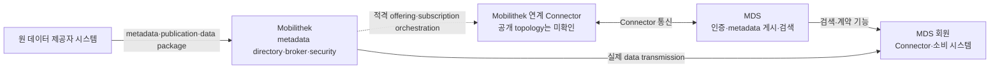
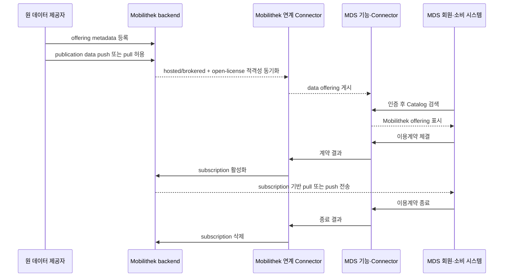

# MDS-Mobilithek·MobiData BW 연계 참조 사례

작성일: 2026-07-11  
작성 기준: 2026-07-11  
상태: Draft

## 1. 목적과 판정 범위

- **(목적)** MDS-Mobilithek과 MobiData BW 사례에서 기존 플랫폼·Connector·계약·구독·전송의 책임 경계 확인
- **(핵심 판정)** 두 사례는 기존 플랫폼을 유지하고 데이터 스페이스를 추가 계약·배포 경로로 연결
- **(제외)** 기존 플랫폼의 전체 검색 레코드 복사, 중앙 저장소 이관과 공개되지 않은 DSP message·API·ID mapping 추정
- **(적용 범위)** 국토교통 Platform Bridge의 역할 분류, Offering 적격성, lifecycle orchestration과 검증 질문 도출

기존 플랫폼 연결은 다음 두 방식으로 구분한다.

1. 기존 플랫폼의 검색 레코드를 데이터 스페이스 Catalog에 복사한다.
2. 기존 플랫폼을 하나의 데이터 제공 시스템으로 유지하면서, 그 플랫폼의 데이터 제공 기능을 Connector의 Catalog·계약·전송 절차에 연결한다.

MDS와 Mobilithek의 연계는 두 번째에 가깝다. MDS는 인증과 데이터 오퍼의 게시·검색을 담당하고, 실제 데이터는 Mobilithek에서 MDS 회원에게 전달된다. 데이터가 MDS 중앙 저장소로 이관되는 구조가 아니다. 이 역할 분담은 [MDS의 Mobilithek Data Offering 설명](https://mobility-dataspace.eu/data-catalogue)에 명시돼 있다.

MobiData BW 사례는 또 다른 배치 방식을 보여준다. MobiData BW는 기존 광역 모빌리티 데이터 플랫폼을 유지한 채 자체 Connector로 데이터를 MDS에 제공한다. [MobiData BW의 공식 설명](https://mobidata-bw.de/blog/daten-mds)은 이를 "eigener Connector", 즉 자체 Connector라고 표현한다.

두 사례에서 가져올 수 있는 패턴은 다음과 같이 다르다.

| 사례 | 기존 플랫폼의 참여 방식 | 데이터 스페이스에서 보이는 결과 |
| --- | --- | --- |
| MDS-Mobilithek | 플랫폼 단위 연계 Connector와 계약-구독 연동 | MDS 회원이 별도 Mobilithek 등록 없이 적격 오퍼를 검색·계약·이용 |
| MDS-MobiData BW | 기존 플랫폼이 Provider 회원으로 참여하고 자체 Connector 운영 | MobiData BW의 데이터가 MDS의 추가 제공 채널을 통해 유통 |

공개 자료에서 확인되는 시스템 경계만 사실로 기록한다. 공개되지 않은 DSP message, 내부 API와 identifier mapping은 `Unverified`로 유지한다.

## 2. 근거 상태

문장과 표의 상태 표시는 다음 의미로 사용한다.

- `Verified`: 운영기관, 플랫폼 운영자 또는 해당 사례 당사자의 공식 자료에서 직접 확인했다.
- `Inferred`: 여러 확인 사실을 함께 놓았을 때 성립하는 기술 해석이다. 실제 구현과 다를 수 있다.
- `Unverified`: 공개된 자료만으로는 확인할 수 없다. 운영기관 답변, 명세 또는 시험이 필요하다.
- `Project implication`: 국토교통 분야 연계 설계에 적용할 제안이다. 해외 사례에서 자동으로 도출되는 의무사항은 아니다.

운영기관이 스스로 공표한 자료만으로 확인한 동작은 `Verified`라도 공표 자료 기준임을 문장에 함께 표시한다. 이런 동작의 실제 자동화 구현과 실패 처리는 관찰하지 않았다.

확인일은 2026-07-11이다. 웹 화면과 운영 문서는 이후 바뀔 수 있다.

## 3. 계약·전송 객체의 구분

이 사례에는 서로 다른 네 객체가 등장한다. 이름을 섞으면 계약과 전송 설계가 잘못된다.

| 객체 | 의미 | 이 사례에서의 위치 |
| --- | --- | --- |
| 데이터 오퍼 | 데이터 설명, 제공 조건, 접근 가능한 표현을 광고하는 단위 | MDS에서 검색하고 계약 대상으로 선택 |
| 이용계약 | 누가 어떤 조건으로 데이터를 사용할지 합의한 결과 | 중개 데이터의 경우 MDS 안에서 체결·종료 가능 |
| Mobilithek 구독 | Mobilithek broker가 특정 소비자에게 데이터 패키지를 전달하기 위한 운영 객체 | MDS 이용계약에 맞추어 자동 활성화·삭제 |
| 전송 실행 | 실제 데이터 패키지를 pull 또는 push로 전달하는 동작 | Mobilithek과 MDS 회원 사이에서 수행 |

`Verified` MDS는 중개된 Mobilithek 데이터의 이용계약을 MDS에서 체결하고 종료할 수 있으며, Mobilithek은 필요한 구독 활성화와 삭제를 자동 수행한다고 설명한다. 근거: [MDS Data Catalogue의 Mobilithek 절](https://mobility-dataspace.eu/data-catalogue).

`Unverified` 공개 자료에는 MDS 계약 ID, EDC Contract Agreement ID, Mobilithek subscription ID의 cardinality와 mapping 규칙이 없다. `계약 하나 = 구독 하나`라고 가정할 수 없다. 하나의 계약으로 여러 전송을 허용하거나, 표현별로 여러 구독을 만들 가능성도 설계에서 열어 둬야 한다.

## 4. 구축 경과

공식 자료의 연도 표현만 보면 연결 완료 시점이 서로 다르게 보인다. 단계별 기능 공개를 하나의 완료 시점으로 표현했을 가능성이 있다.

| 시점 | 공식 기록 | 해석 시 주의점 |
| --- | --- | --- |
| 2023년 | 독일 연방정부 답변은 2023년 7월까지 첫 Mobilithek 정적 데이터를 MDS에서 검색·취득 가능하게 할 계획이라고 밝혔다. 근거: [독일 연방의회 문서 20/7077, 질문 13 답변](https://dserver.bundestag.de/btd/20/070/2007077.pdf). | 첫 데이터 공개 계획이지 전체 수명주기 연계 완료의 증거는 아니다. |
| 2024-09/10 | MDS와 MobiData BW는 Solita가 MDS를 통해 MobiData BW 주차 데이터를 이용한 사례를 공개했다. 근거: [MDS 보도자료](https://mobility-dataspace.eu/fileadmin/05_presse_medien/20240926_MDS_Solita_EN.pdf), [MobiData BW 게시물](https://mobidata-bw.de/blog/daten-mds). | MobiData BW 자체 Connector 사례다. Mobilithek의 계약-구독 자동화 완료 시점을 뜻하지 않는다. |
| 2025-03 | 독일 연방교통부는 두 인프라를 연결 중이라고 설명했다. 근거: [BMV 모빌리티 데이터 생태계 설명](https://www.bmv.de/SharedDocs/DE/Artikel/G/das-oekosystem-fuer-mobilitaetsdaten.html). | 정부 페이지 작성 당시 진행 상태다. |
| 2025년 상반기 | 현재 MDS 사이트는 Mobilithek과의 완전한 연결이 2025년 상반기에 이루어졌다고 기록한다. 근거: [MDS 공식 홈페이지](https://mobility-dataspace.eu/). | 현재 공개된 운영 설명을 판단 기준으로 사용한다. |

`Inferred` 이 기록은 연계가 정적 데이터 공개, Connector 연결, 계약-구독 자동화 순으로 확장됐을 가능성을 보여준다.

- `Unverified` 단계별 배포 version·전환일·migration 절차와 완료 기준은 공개 자료에서 확인되지 않음
- `Project implication` 국토교통 실증의 완료 조건은 Catalog·계약·provisioning·전송·종료 단계별로 분리

## 5. 시스템별 역할

### 5.1 MDS

`Verified` MDS는 Mobilithek 오퍼 연계에서 참가자 인증, metadata publication, metadata searchability를 담당한다. 데이터 전송은 Mobilithek과 MDS 회원 사이에서 이뤄진다. 근거: [MDS Data Catalogue](https://mobility-dataspace.eu/data-catalogue).

`Verified` MDS 회원은 EDC 기반 MDS Connector를 설치하거나 Connector-as-a-Service를 이용할 수 있다. 데이터 제공자는 자신의 데이터 정보를 Catalog에 추가한다. 근거: [MDS 참여 절차](https://mobility-dataspace.eu/mobility-data-space).

`Verified` MDS Connector는 EDC를 기반으로 하며 제공자와 수신자 사이의 데이터 교환을 중개하는 구성요소로 설명된다. 근거: [MDS Data Catalogue의 EDC Connector 절](https://mobility-dataspace.eu/data-catalogue).

`Unverified` 공개 사례 문서는 MDS가 사용하는 EDC release, DSP revision, identity protocol, policy profile과 Connector endpoint를 제시하지 않는다. 이 사례를 `DSP 2025-1` wire conformance의 증거로 인용하면 안 된다.

### 5.2 Mobilithek

- `Verified` Mobilithek은 독일 National Access Point이며 metadata directory와 data broker 기능을 함께 운영
- `Verified` [Mobilithek 기술 인터페이스 명세 1.3.2](https://mobilithek.info/cms/downloads/tssb-de)는 Security·metadata directory·broker system·web administration을 구분
- `Verified` broker system은 data package 처리 담당

`Verified` Mobilithek은 온라인 교통 데이터의 검색·제공·구독을 지원한다. 중개 데이터 전송은 REST 유사 API를 우선 사용하며 단순 객체 접근 프로토콜(Simple Object Access Protocol, SOAP)도 지원한다.

`Verified` 교통 제어 시스템 간 개방형 통신 인터페이스(Open Communication Interface for Road Traffic Control Systems, OCIT-C)도 지원한다. 근거: [Mobilithek 기술 인터페이스 명세 1.3.2, 1장](https://mobilithek.info/cms/downloads/tssb-de).

`Verified` 데이터 제공자와 수신자의 기계 간 통신은 Security 구성요소의 인증을 거쳐 broker system에 연결된다. 전송에는 TLS 1.2 또는 1.3과 X.509v3 machine certificate가 요구된다. 근거: [Mobilithek 기술 인터페이스 명세 1.3.2, 2장·4.6절](https://mobilithek.info/cms/downloads/tssb-de).

- `Verified` Mobilithek은 brokered offering과 non-brokered offering 구분
- `Verified` brokered 동적 데이터는 구독이 필요하며 제공자는 자동 승인 또는 사전 승인 선택 가능
- `Verified` non-brokered offering은 구독 없이 원천 접근방식으로 이용
- 근거: [Mobilithek 공식 factsheet, 2쪽](https://mobilithek.info/cms/downloads/faktenblatt)

`Unverified` MDS가 사용하는 "hosted"와 "brokered"의 정확한 차이, 정적 파일 hosting 방식, MDS에 포함되는 Mobilithek offering 선정 job은 공개 기술 명세에 없다.

### 5.3 원 데이터 제공자

`Verified` 원 데이터 제공자는 Mobilithek에서 조직과 제공 권한을 등록하고 데이터 오퍼의 metadata, 이용조건과 유효기간을 입력할 수 있다. 동적 데이터 시스템은 표준 인터페이스와 인증서를 사용해 Mobilithek에 데이터를 공급할 수 있다. 근거: [Mobilithek 공식 factsheet, 2쪽](https://mobilithek.info/cms/downloads/faktenblatt).

`Verified` Mobilithek broker 관점에서 원 제공자 시스템은 data publisher이고 Mobilithek은 subscriber다. 제공자가 push하거나 Mobilithek이 pull할 수 있다. 근거: [Mobilithek 기술 인터페이스 명세 1.3.2, 4.6절](https://mobilithek.info/cms/downloads/tssb-de).

`Unverified` MDS에서 보이는 Mobilithek 오퍼의 법적 assigner가 원 제공자인지, Mobilithek인지, 위임받은 별도 참가자인지는 공개 자료에 없다. 데이터별 계약 당사자와 책임 주체를 Catalog 표시명만으로 판단하면 안 된다.

### 5.4 MDS 회원과 소비 시스템

`Verified` MDS 회원은 Mobilithek에 별도로 등록하지 않고 연계된 Mobilithek 오퍼에 접근할 수 있다. 익숙한 MDS 기능으로 검색하고 이용할 수 있다는 것이 공식 설명이다. 근거: [MDS Data Catalogue](https://mobility-dataspace.eu/data-catalogue).

`Verified` Mobilithek broker 관점에서 수신자 시스템은 subscriber이고 Mobilithek은 publisher다. 수신자가 subscription ID로 pull하거나, Mobilithek이 수신자에게 push할 수 있다. 근거: [Mobilithek 기술 인터페이스 명세 1.3.2, 4.6절·6.2절](https://mobilithek.info/cms/downloads/tssb-de).

- `Unverified` "별도 등록 불필요"라는 설명만으로 MDS와 Mobilithek 사이의 통합 인증(Single Sign-On, SSO)을 판정할 수 없음
- `Unverified` MDS participant identity와 Mobilithek machine identity·organization·subscription owner의 mapping 방식은 미공개
- `Unverified` MDS CaaS의 portal SSO 설명은 Mobilithek identity federation 구현의 증거가 아님

## 6. 연계 대상 Offering의 범위

MDS의 설명은 Mobilithek 전체 검색 레코드가 아니라 다음 조건을 만족하는 오퍼를 대상으로 한다.

1. content가 Mobilithek에 hosted 또는 brokered돼 있다.
2. open-data license가 있다.

근거: [MDS Data Catalogue의 Mobilithek Data Offering 절](https://mobility-dataspace.eu/data-catalogue).

이 조건에는 두 가지 제한이 들어 있다.

- `Verified` 소재 정보만 있고 데이터 전달에 Mobilithek이 관여하지 않는 non-brokered record는 위 설명만으로 MDS 전송 오퍼라고 볼 수 없다.
- `Verified` Mobilithek은 개방·제한·유료를 포함한 여러 이용조건 지원. 근거: [Mobilithek factsheet](https://mobilithek.info/cms/downloads/faktenblatt)
- `Verified` MDS 통합 페이지의 대상은 open-data license를 가진 hosted 또는 brokered content. 근거: [MDS Data Catalogue](https://mobility-dataspace.eu/data-catalogue)
- `Inferred` Mobilithek 전체 지원 범위와 MDS에 투영되는 Offering 범위는 동일하지 않음
- `Unverified` 조건을 충족하는 모든 오퍼가 자동으로 MDS에 게시되는지, 운영자가 allowlist를 관리하는지, 품질·형식에 따른 추가 제외조건이 있는지는 공개되지 않았다.

`Project implication` 국토교통 데이터 통합 채널의 검색 결과도 record 단위로 `hosted`, `brokered`, `index-only`를 분류해야 한다. `index-only`에는 실제 Distribution과 DataService를 꾸며 넣지 않는다.

## 7. 확인된 논리 구조

아래 그림의 실선은 공식 설명에서 확인된 관계다. 점선은 공개 자료에 구체적인 interface가 없는 경계다.



이 그림에서 `MDS`는 하나의 중앙 서버 제품을 뜻하지 않는다. MDS가 제공하는 인증·Catalog·Portal 기능과 참가자 Connector가 함께 만드는 논리 영역이다. 공개 자료는 Mobilithek이 "Connectors"로 기술 연결된다고만 설명하며 Connector 수와 배치를 공개하지 않는다.

`Verified` 실제 payload 경로의 상대방은 Mobilithek과 MDS 회원이다. MDS 보도자료도 MDS Catalog는 설명을 제공할 뿐 데이터를 저장하지 않고, 데이터는 회원 사이에서 직접 교환된다고 설명한다. 근거: [MDS-Solita 보도자료, 2쪽](https://mobility-dataspace.eu/fileadmin/05_presse_medien/20240926_MDS_Solita_EN.pdf).

`Unverified` "직접"이 소비자 Connector Data Plane을 경유한다는 뜻인지, Mobilithek endpoint에서 회원의 업무 시스템으로 곧바로 전달된다는 뜻인지는 공개 그림과 문장만으로 확정할 수 없다. 네트워크 hop과 logical provider-consumer 관계를 구분해야 한다.

## 8. Metadata 게시부터 구독 종료까지의 수명주기

### 8.1 원 플랫폼 등록

1. 원 제공자는 Mobilithek에 사용자 계정과 데이터 제공 권한을 가진 조직을 등록한다.
2. 제공자는 data offering을 만들고 metadata와 이용조건을 기록한다.
3. brokered dynamic data라면 제공자 시스템을 Mobilithek broker interface에 연결한다.
4. 제공자 push 또는 Mobilithek pull로 최신 data package를 broker에 넣는다.

1~4는 [Mobilithek factsheet](https://mobilithek.info/cms/downloads/faktenblatt)와 [기술 인터페이스 명세 1.3.2](https://mobilithek.info/cms/downloads/tssb-de)에서 확인된다.

`Verified` Mobilithek의 metadata directory는 publication 정보를 관리하고 broker system은 data package를 처리한다. metadata와 payload 경로가 내부에서도 분리돼 있다.

`Unverified` 원 제공자의 오퍼 승인, 품질검사 실패 처리, MDS 연계 동의가 별도 workflow인지 확인되지 않았다.

### 8.2 MDS 게시 대상 판정

1. Mobilithek이 hosted 또는 brokered하는 content인지 판정한다.
2. open-data license가 있는지 판정한다.
3. 적격 오퍼의 metadata를 MDS에서 게시·검색 가능하게 만든다.

`Verified` 대상 조건과 MDS의 publication·search 역할은 [MDS Data Catalogue](https://mobility-dataspace.eu/data-catalogue)에 명시돼 있다.

`Inferred` 실제 구현에는 Mobilithek offering ID를 MDS Dataset/Asset ID에 대응시키는 mapper와 변경 동기화가 필요하다. 그렇지 않으면 계약 후 어느 publication과 subscription을 provision할지 찾을 수 없다.

`Unverified` metadata export format, polling 또는 event 방식, field mapping, 갱신주기, 삭제 tombstone과 identifier 안정성은 공개되지 않았다.

### 8.3 검색과 참가자 인증

1. MDS 회원이 MDS 기능을 사용해 Mobilithek 오퍼를 검색한다.
2. MDS가 회원 인증을 담당한다.
3. 회원은 Mobilithek 사용자 계정을 따로 만들지 않는다.

세 항목은 [MDS Data Catalogue](https://mobility-dataspace.eu/data-catalogue)에서 확인된다.

`Inferred` MDS identity를 Mobilithek subscription owner에 연결하는 trust mapping 또는 service account가 있어야 한다.

`Unverified` identity claim, organization ID, certificate 발급 주체, 탈퇴 동기화와 계정 충돌 처리 방식은 공개되지 않았다.

### 8.4 이용계약 체결

1. 소비자가 MDS 안에서 brokered Mobilithek data offering의 이용계약을 체결한다.
2. 계약 결과가 Mobilithek 쪽 provisioning에 전달된다.

`Verified` 1번과 계약에 따른 subscription 자동 처리는 [MDS Data Catalogue](https://mobility-dataspace.eu/data-catalogue)에 설명돼 있다.

- `Inferred` DSP 설계에서는 Catalog Offer 선택과 Contract Negotiation 완료 뒤 backend subscription provisioning을 시작하는 구조가 필요
- `Inferred` EDC Control Plane은 Offering·계약을 관리하고 실제 전송은 Data Plane에 위임
- 근거: [EDC Developer Handbook](https://github.com/eclipse-edc/docs/blob/main/developer/handbook.md)

`Unverified` 실제 운영 연계가 어느 DSP revision과 message를 사용하는지, MDS portal의 계약 동작이 DSP Contract Negotiation과 일대일인지, 법적 계약서와 machine-readable Agreement가 어떻게 연결되는지는 공개되지 않았다.

### 8.5 Mobilithek 구독 활성화

1. MDS에서 이용계약이 성립한다.
2. Mobilithek이 데이터 전달에 필요한 subscription을 자동 활성화한다.
3. 이후 수신자는 subscription에 연결된 데이터를 받을 수 있다.

`Verified` MDS는 필요한 구독 활성화 절차가 Mobilithek에서 자동 수행된다고 명시한다. 이 확인은 운영자 공표 자료 기준이며 실제 자동화 동작은 관찰하지 않았다(`C-032`). 근거: [MDS Data Catalogue](https://mobility-dataspace.eu/data-catalogue).

`Inferred` 이 단계에는 중복 계약 event를 처리하는 idempotency key, MDS agreement와 Mobilithek subscription의 mapping store, 실패 시 재시도 또는 보상 처리가 필요하다.

- `Unverified` 자동화 API·callback·message broker와 transaction 경계는 미공개
- `Unverified` 승인 대기·timeout·부분 실패와 재처리 방식도 미공개

### 8.6 실제 데이터 전달

Mobilithek의 일반 broker interface는 다음 전달 방식을 지원한다.

| 방향 | 방식 | 식별자·동작 |
| --- | --- | --- |
| 원 제공자 → Mobilithek | Provider push | publication ID를 포함해 HTTPS `POST`로 data package 전달 |
| 원 제공자 → Mobilithek | Mobilithek pull | publication description의 URL을 Mobilithek이 조회 |
| Mobilithek → 수신자 | Consumer pull | 수신자가 subscription ID를 포함해 HTTPS `GET` |
| Mobilithek → 수신자 | Mobilithek push | Mobilithek이 등록된 수신자 URL로 data package 전달 |

근거: [Mobilithek 기술 인터페이스 명세 1.3.2, 4.6절·6장](https://mobilithek.info/cms/downloads/tssb-de).

- `Verified` 일반 REST interface는 HTTP body에 임의 형식 payload를 수용하고 broker는 payload를 변경하지 않고 전달
- `Verified` Mobilithek broker는 도로교통 데이터 교환 표준(Data Exchange for Traffic and Travel Information, DATEX II)과 legacy container interface를 제공
- `Verified` Consumer pull은 subscription ID에 연결된 package buffer에서 데이터를 조회해 반환
- 근거: [Mobilithek 기술 인터페이스 명세 1.3.2, 3장·6.2절](https://mobilithek.info/cms/downloads/tssb-de)

`Verified` MDS-Mobilithek 연계에서 transmission은 Mobilithek과 MDS 회원 사이에 직접 이뤄진다. 근거: [MDS Data Catalogue](https://mobility-dataspace.eu/data-catalogue).

`Unverified` MDS 연계가 일반 Mobilithek REST endpoint를 그대로 사용하는지, EDC Data Plane proxy를 사용하는지, MDS Transfer Process의 `format`과 Mobilithek delivery mode를 어떻게 대응시키는지는 공개되지 않았다.

### 8.7 이용계약 종료와 정리

1. MDS에서 brokered data의 이용계약을 종료한다.
2. Mobilithek이 관련 subscription을 자동 삭제한다.
3. 삭제 뒤에는 해당 subscription ID를 이용한 전달이 중단돼야 한다.

`Verified` 계약 종료와 subscription 삭제의 자동 연동은 [MDS Data Catalogue](https://mobility-dataspace.eu/data-catalogue)에 명시돼 있다. 이 확인도 운영자 공표 자료 기준이며 실제 삭제 동작과 실패 처리는 관찰하지 않았다(`C-032`).

`Inferred` subscription 삭제는 backend access 회수다. DSP Transfer Process termination과 같은 객체라고 볼 수는 없다. 계약은 유지한 채 특정 transfer만 끝낼 수 있고, 계약 종료 때 여러 transfer와 subscription을 함께 정리할 수도 있기 때문이다.

- `Unverified` 진행 중 push 중단, 내려받은 파일·cache·단기 token의 처리 방식은 미공개
- `Unverified` 재계약, 삭제 실패 reconciliation과 감사 증적 처리 방식도 미공개

### 8.8 오퍼 수정·삭제

`Verified` Mobilithek 제공자는 자체 오퍼를 저장하고 게시 전에 수정할 수 있으며, metadata catalog 간 자동 교환 interface도 지원한다. 근거: [Mobilithek factsheet](https://mobilithek.info/cms/downloads/faktenblatt).

`Unverified` 게시 뒤 수정·철회가 MDS Catalog에 도달하는 시간, 진행 중 계약에 미치는 영향, license 변경 처리와 삭제 event 형식은 공개되지 않았다. Catalog 최초 등록만 구현하면 운영 연계가 완성되지 않는다.

## 9. 수명주기 시퀀스

아래 시퀀스에서 굵은 의미 관계는 확인됐지만, `적격성 동기화`와 `구독 활성화/삭제`에 사용되는 실제 API는 공개되지 않았다.



`Unverified` 실제 구현에서는 `G`와 `M`이 여러 Connector와 service로 나뉘거나 일부가 합쳐져 있을 수 있다. 이 시퀀스는 공개된 역할을 설명하기 위한 논리 모델이다.

## 10. DSP 적용 범위와 구현 경계

DSP는 Catalog, Contract Negotiation, Transfer Process를 규정하지만 실제 payload protocol을 규정하지 않는다. 근거: [Dataspace Protocol 2025-1 errata](https://eclipse-dataspace-protocol-base.github.io/DataspaceProtocol/2025-1-err1/).

이 경계를 MDS-Mobilithek 사례에 적용하면 다음처럼 해석할 수 있다.

| DSP 영역 | Mobilithek 연계에 필요한 역할 | 공개 사례에서 확인되는 수준 |
| --- | --- | --- |
| Catalog | Mobilithek metadata를 Dataset·Offer·Distribution·DataService로 게시 | MDS가 metadata 게시·검색을 담당한다는 사실만 확인. 실제 JSON-LD mapping은 미공개 |
| Contract Negotiation | MDS 회원과 제공 측이 이용조건에 합의 | brokered data의 계약을 MDS에서 체결·종료 가능. protocol revision과 message는 미공개 |
| Transfer Process | Agreement를 근거로 전달을 시작·정지·종료 | Mobilithek subscription 자동 활성화·삭제는 확인. DSP state와 subscription state mapping은 미공개 |
| Data Transfer | 실제 payload를 pull/push로 전달 | Mobilithek-회원 직접 전달과 Mobilithek의 일반 pull/push 방식은 확인. MDS별 transfer profile은 미공개 |

`Project implication` 국토교통 Platform Bridge는 DSP endpoint만 구현해서 끝나지 않는다. 다음 내부 상태를 명시적으로 연결해야 한다.

```text
DSP Dataset/Offer
  -> 기존 플랫폼 dataset/offering/publication

DSP Agreement
  -> 플랫폼 subscription/entitlement

DSP Transfer Process
  -> 플랫폼 delivery endpoint, export job, stream consumer 또는 signed URL

DSP termination 또는 계약 종료
  -> subscription, token, ACL, export artifact 정리
```

각 화살표에는 mapping ID, 상태, 마지막 동기화 시각, 재시도 횟수와 정리 결과가 필요하다. 이 항목은 Mobilithek 공개 자료에서 복사한 구현이 아니라, 같은 수명주기를 재현하기 위한 프로젝트 요구사항이다.

## 11. MobiData BW: 기존 플랫폼이 자체 Connector를 둔 경우

### 11.1 확인된 구조

`Verified` MobiData BW는 바덴뷔르템베르크주의 교통수단 통합 open-data platform이다. MobiData BW는 MDS 회원으로서 자체 데이터를 자체 Connector를 통해 제공한다고 밝힌다. 근거: [MobiData BW 공식 게시물](https://mobidata-bw.de/blog/daten-mds).

- `Verified` MobiData BW는 MDS를 추가 서비스 플랫폼으로 사용
- `Verified` 데이터 조건과 peer-to-peer 흐름은 MDS 회원 사이에서 결정·수행
- `Verified` Solita는 여러 제공자의 데이터를 하나의 EDC Connector interface로 수신
- 근거: [MDS-Solita 보도자료](https://mobility-dataspace.eu/fileadmin/05_presse_medien/20240926_MDS_Solita_EN.pdf)

`Verified` 실제 사용 사례는 MobiData BW가 집계한 주차 데이터를 Solita가 MDS를 통해 받아 지도 기반 도시 정보에 사용한 것이다. 근거: [MobiData BW 공식 게시물](https://mobidata-bw.de/blog/daten-mds), [MDS Solita use case](https://mobility-dataspace.eu/use-cases/solita).

### 11.2 기존 플랫폼은 그대로 남는다

MobiData BW의 현행 주차 Dataset은 다음 resource를 제공한다.

- ParkAPI와 DATEX II Light
- 웹 맵 서비스(Web Map Service, WMS)
- 웹 피처 서비스(Web Feature Service, WFS)
- 쉼표 구분값(Comma-Separated Values, CSV)

이 Dataset은 `Datenlizenz Deutschland Namensnennung 2.0`을 표시한다. 근거: [MobiData BW 주차 데이터셋](https://mobidata-bw.de/dataset/gebuendelte-parkdaten-bw).

- `Inferred` Connector는 기존 플랫폼의 data offering과 endpoint를 데이터 스페이스 계약·전송 interface로 연결
- `Inferred` MobiData BW의 종합 지식 아카이브 네트워크(Comprehensive Knowledge Archive Network, CKAN) catalog와 ParkAPI를 MDS 저장소로 이전했다는 근거는 없음

`Unverified` Solita가 받은 Distribution이 ParkAPI, 파일, proxy endpoint 중 무엇이었는지, MDS Connector가 payload를 relay했는지 또는 endpoint access만 provision했는지는 공개 자료에 없다.

### 11.3 Mobilithek 방식과 다른 점

| 항목 | Mobilithek | MobiData BW |
| --- | --- | --- |
| 플랫폼 역할 | metadata directory이면서 일부 데이터를 실제 broker | 여러 원천을 집계·정규화해 open data로 제공하는 광역 플랫폼 |
| Connector 배치 | Mobilithek이 Connectors로 MDS에 기술 연결됨. 세부 topology 미공개 | MobiData BW가 자체 Connector를 운영한다고 명시 |
| backend 수명주기 연동 | MDS 계약에 따라 Mobilithek subscription 활성화·삭제 | 공개 자료에 별도 subscription orchestration 설명 없음 |
| 소비자 이점 | Mobilithek 별도 등록 없이 MDS 기능 사용 | 여러 MDS 제공자의 데이터에 EDC Connector 하나로 접근 |
| payload 경로 | Mobilithek에서 MDS 회원으로 직접 전달 | MDS 회원 간 peer-to-peer라고 설명. 구체적 representation은 미공개 |

Mobilithek은 기존 플랫폼의 subscription system까지 계약 수명주기에 연결한 사례다. MobiData BW는 기존 플랫폼이 Provider Connector를 두고 데이터 스페이스를 추가 배포 채널로 사용한 사례다. 국토교통 통합 채널은 데이터별 역할에 따라 두 방식을 함께 써야 할 수 있다.

## 12. 국토교통 플랫폼에 적용할 때의 판정

### 12.1 플랫폼 직접 제공

다음 조건을 만족하면 MobiData BW형 Provider Connector가 맞다.

- 플랫폼이 payload API, file, 지리정보시스템(Geographic Information System, GIS) service 또는 stream을 운영한다.
- 플랫폼이 제공계약을 체결하거나 원 제공자로부터 그 권한을 위임받았다.
- Connector가 사용할 server-to-server credential과 SLA가 있다.
- 계약 종료 때 token, quota, stream consumer 또는 export artifact를 정리할 수 있다.

Connector는 플랫폼을 대체하지 않는다. Catalog와 계약은 northbound DSP interface로 제공하고, 실제 data source는 기존 API와 저장소에 둔다.

### 12.2 플랫폼 계약·구독 중개

다음 조건을 만족하면 Mobilithek형 Platform Bridge가 맞다.

- 플랫폼에 subscription, entitlement, 활용신청 또는 API key 발급 객체가 있다.
- subscription을 생성·승인·정지·삭제할 공식 API나 운영 interface가 있다.
- 데이터가 플랫폼 broker를 통해 전달되거나 플랫폼이 전달 endpoint를 provision한다.
- 데이터 스페이스 identity를 플랫폼의 organization/subscription owner로 대응시킬 수 있다.

Bridge는 DSP Agreement와 플랫폼 subscription을 별도 객체로 관리하고 양쪽 상태를 조정해야 한다.

### 12.3 플랫폼 소재 색인

원천 landing page와 설명만 보유하고 payload·구독·제공권한이 없다면 discovery 연계만 가능하다.

- 포털 또는 DCAT catalog에 metadata와 원천 URL을 제공할 수 있다.
- 전송 가능한 Distribution·DataService가 없으면 DSP Dataset Offer로 게시하지 않는다.
- DSP 제공이 필요하면 원 기관 Connector를 연결하거나, 원 기관이 권한과 endpoint 운영을 기존 플랫폼에 위임해야 한다.

Mobilithek 사례를 근거로 index-only record까지 자동으로 DSP offering으로 바꾸면 안 된다. MDS가 연계하는 대상 자체가 hosted 또는 brokered content로 제한돼 있기 때문이다.

## 13. 국토교통 Platform Bridge의 최소 구성

MDS-Mobilithek과 MobiData BW에서 확인한 역할을 국내 구조로 옮기면 세 경계가 필요하다.

### 13.1 데이터 스페이스 경계

- DSP Catalog endpoint
- Contract Negotiation endpoint
- Transfer Process endpoint
- 참가자 identity와 policy validation
- Connector 관리 API가 Dataset·Offer·Distribution·DataService의 생성·수정·철회를 제공하고 contract test 결과를 기록

### 13.2 기존 플랫폼 경계

- metadata bulk export와 delta/delete feed
- data API, file, object store, OGC service, stream 또는 query engine
- 기존 플랫폼 API가 subscription·활용신청·entitlement·API key의 생성·조회·회수를 제공하고 sandbox 시험 결과를 기록
- source별 license, quota, 갱신주기와 장애 상태

### 13.3 수명주기 조정 경계

- platform dataset ID와 DSP Dataset ID mapping
- DSP Agreement와 platform subscription mapping
- transfer format과 실제 delivery mode mapping
- 활성화·삭제의 idempotency와 retry
- 부분 실패 보상과 정기 reconciliation
- 계약·구독·전송·회수 audit

세 번째 경계가 없으면 Catalog federation은 가능해도 Mobilithek과 같은 운영 연계는 구현되지 않는다.

## 14. 공개 자료의 미확인 사항

다음 항목은 사례를 재현하기 전에 MDS·Mobilithek 운영자 또는 구현사에 확인해야 한다. 국내 조사 경로로는 KALDA와 회원사가 MDS 측과 협력 체계를 추진한다는 2025-12 보도가 있으나 1차 문서는 미확인이다(`C-063`). 1차 문서가 확보되면 이 표의 질문을 해당 채널로 전달하는 방안을 검토한다.

| 영역 | 필요한 질문 |
| --- | --- |
| Protocol | 실제 Connector release와 DSP/IDS protocol version은 무엇인가? |
| Connector topology | Mobilithek 쪽 Connector는 몇 개이며 control/data plane은 어디에 배치되는가? |
| Catalog sync | metadata export·delta·delete interface와 schema는 무엇인가? |
| Identifier | Mobilithek offering/publication/subscription과 MDS Dataset/Agreement/Transfer ID는 어떻게 대응하는가? |
| Eligibility | hosted/brokered+open-license 외에 품질·형식·승인 allowlist가 있는가? |
| Identity | MDS 회원을 Mobilithek 조직과 machine identity로 어떻게 대응시키는가? |
| Provisioning | 계약 체결·종료 event와 subscription 활성화·삭제 API는 무엇인가? |
| Failure handling | 양쪽 상태가 어긋날 때 retry, rollback, reconciliation은 어떻게 수행하는가? |
| Transfer | MDS Distribution별 Mobilithek pull/push endpoint와 format mapping은 무엇인가? |
| Revocation | in-flight delivery, token, cache와 이미 전달된 파일을 어떻게 처리하는가? |
| Provider authority | 계약 assigner, 원 제공자, Mobilithek의 법적 책임은 데이터별로 어떻게 표시하는가? |
| Operations | quota, SLA, schema 변경 통지, 장애 공지와 감사 보존기간은 무엇인가? |

이 답이 없으면 사례의 외형만 모사하게 된다. 특히 subscription 자동 삭제는 한 문장으로 설명하기 쉽지만, production에서는 실패·재시도·감사까지 포함해야 한다.

## 15. 프로젝트 채택 참조 패턴

`Project implication` 연구의 기준 구조는 다음과 같이 잡는다.

```text
Existing Data Platform
  catalog / metadata
  data APIs / files / GIS / streams
  subscription / entitlement
          |
          v
Platform-to-Dataspace Bridge
  offering eligibility and mapping
  agreement-to-subscription orchestration
  transfer-to-delivery binding
  termination and reconciliation
          |
          v
DSP Provider Connector
  Catalog / Contract Negotiation / Transfer Process
          |
          v
Data Space Consumer Connector
```

MDS-Mobilithek에서 직접 확인되는 설계 원칙은 다음 네 가지다.

1. 기존 플랫폼의 전체 Catalog가 아니라 실제로 hosted 또는 brokered되고 license가 맞는 오퍼만 연계한다.
2. 데이터 스페이스의 인증·계약 경험과 기존 플랫폼의 구독·전달 시스템을 연결한다.
3. 별도 플랫폼 가입 절차를 소비자에게 반복시키지 않되, backend identity와 권한 mapping을 둔다.
4. payload를 데이터 스페이스 중앙 저장소로 복제하지 않고 기존 플랫폼의 전달 책임과 endpoint를 유지한다.

MobiData BW에서 직접 확인되는 원칙은 두 가지다.

1. 기존 데이터 플랫폼은 자체 Connector를 운영하는 Provider가 될 수 있다.
2. 데이터 스페이스는 기존 API와 Catalog를 폐기하는 대체 플랫폼이 아니라 추가 제공 채널이 될 수 있다.

- **(선행 판정)** Dataset과 delivery path별로 `hosted·brokered·index-only·unknown` 역할 기록
- **(구조 선택)** 역할 판정 뒤 중앙 Platform Bridge, 기관별 Provider Connector 또는 discovery-only 경로 선택

## 16. 출처 목록

| 출처 | 발행·표시 시점 | 이 문서에서 사용한 범위 |
| --- | --- | --- |
| [MDS Data Catalogue](https://mobility-dataspace.eu/data-catalogue) | 현재 운영 페이지, 2026-07-11 확인 | MDS·Mobilithek 역할, 연계 대상, 별도 등록 불필요, 계약-구독, 전송 경로 |
| [MDS 공식 홈페이지](https://mobility-dataspace.eu/) | 현재 운영 페이지, 2026-07-11 확인 | 2025년 상반기 완전 연결 기록 |
| [MDS 참여 절차](https://mobility-dataspace.eu/mobility-data-space) | 현재 운영 페이지, 2026-07-11 확인 | EDC 기반 Connector와 CaaS 선택지 |
| [Mobilithek factsheet](https://mobilithek.info/cms/downloads/faktenblatt) | 현재 canonical download, 2026-07-11 확인 | 오퍼 등록, metadata 교환, brokered/non-brokered, 구독 조건 |
| [Mobilithek 기술 인터페이스 명세 1.3.2](https://mobilithek.info/cms/downloads/tssb-de) | 2025-11-07 | 구성요소, 인증, publication/subscription, pull/push와 payload 전달 |
| [BMV 모빌리티 데이터 생태계](https://www.bmv.de/SharedDocs/DE/Artikel/G/das-oekosystem-fuer-mobilitaetsdaten.html) | 2025-03-17 | 연계 추진 경과와 두 플랫폼의 공공 역할 |
| [독일 연방의회 문서 20/7077](https://dserver.bundestag.de/btd/20/070/2007077.pdf) | 2023 | 초기 정적 데이터 연계 계획 |
| [MobiData BW의 MDS 게시물](https://mobidata-bw.de/blog/daten-mds) | 2024-10-05 | 자체 Connector, Solita 주차 데이터 사례 |
| [MDS-Solita 보도자료](https://mobility-dataspace.eu/fileadmin/05_presse_medien/20240926_MDS_Solita_EN.pdf) | 2024-09-26 | 단일 EDC interface, 추가 제공 채널, peer-to-peer 데이터 흐름 |
| [MDS Solita use case](https://mobility-dataspace.eu/use-cases/solita) | 현재 사례 페이지, 2026-07-11 확인 | 데이터 제공자와 적용 서비스 확인 |
| [MobiData BW 주차 데이터셋](https://mobidata-bw.de/dataset/gebuendelte-parkdaten-bw) | 현행 데이터셋, 2026-07-11 확인 | 기존 플랫폼의 license와 API·GIS·파일 resource |
| [DSP 2025-1 errata](https://eclipse-dataspace-protocol-base.github.io/DataspaceProtocol/2025-1-err1/) | 2025-1 errata | Catalog·계약·Transfer Process와 실제 전송의 경계 |
| [EDC Developer Handbook](https://github.com/eclipse-edc/docs/blob/main/developer/handbook.md) | 2026-07-11 확인 | EDC Control Plane·Data Plane의 일반 역할. MDS 내부 구현의 증거로 사용하지 않음 |
| [유럽·한국 데이터 동맹 기고](https://www.etnews.com/20251201000039) | 2025-12-01 | KALDA-MDS 협력 추진 보도. 2차 출처이며 미확인 질문의 조사 경로 후보로만 사용 |
