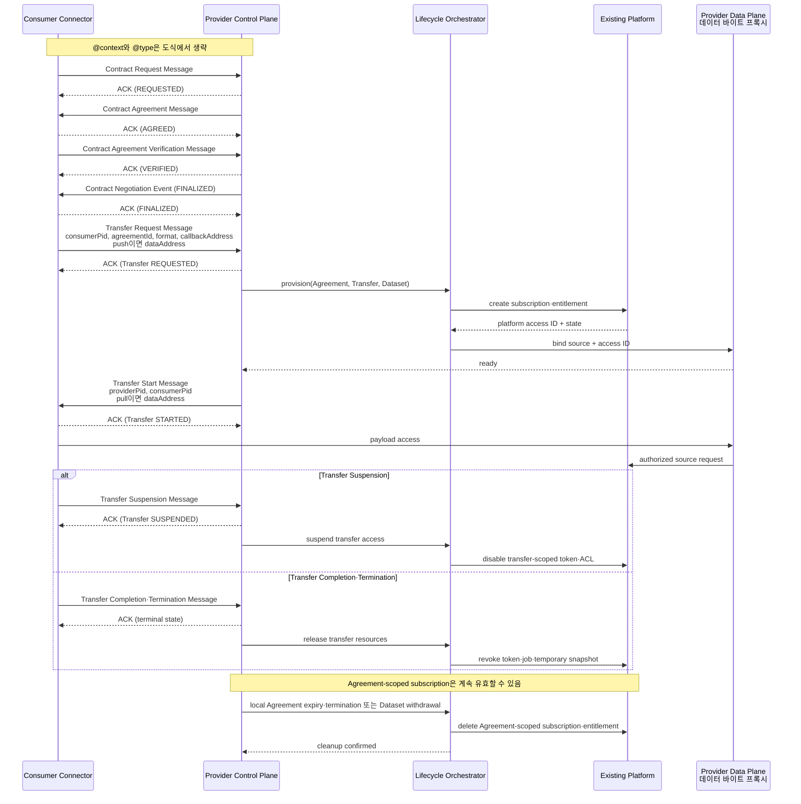

# Offering 온보딩과 접근 수명주기

작성일: 2026-07-11  
작성 기준: 2026-07-11  
상태: Draft

이 문서는 프로젝트 내부 Offering 게시 상태와 플랫폼 접근 자원 수명주기의 정본이다. 조사 문서는 후보 패턴과 근거를 설명한다. DSP wire schema는 DSP 규격을, southbound API 필드는 [플랫폼 인터페이스 계약](platform-interface-contract.md)을 따른다.

## 1. 목적과 상태 범위

이 문서는 Offering 게시 상태와 플랫폼 접근 자원의 수명주기를 분리해 관리하는 기준을 정의한다. 기존 플랫폼을 Connector에 연결하면 세 종류의 상태가 동시에 움직인다.

1. Offering 게시 상태: 검색·권리 판정·게시·수정·철회
2. DSP 상태: Contract Negotiation과 Transfer Process
3. 플랫폼 접근 상태: 신청·구독·token·export job·stream 접근제어목록(Access Control List, ACL)

세 상태를 하나의 `active` 값으로 합치면 계약은 끝났는데 token이 남거나, source가 삭제됐는데 Catalog가 계속 광고하는 문제가 생긴다. 각 상태는 별도로 저장하고 correlation ID로 연결한다.

## 2. Offering 게시 상태

다음 상태는 이 프로젝트의 내부 운영 모델이다. DSP 규격 상태가 아니다.

| 상태 | 의미 | 외부 노출 |
| --- | --- | --- |
| `DISCOVERED` | 플랫폼에서 record를 찾았으나 판정하지 않음 | discovery index 선택 가능 |
| `CATALOG_ONLY` | 소재와 설명은 공개할 수 있지만 거래 경로가 없음 | 포털·DCAT discovery만 |
| `PENDING_EVIDENCE` | 권리·Provider·source·회수 근거가 부족함 | DSP Catalog 금지 |
| `APPROVED` | Offering 생성에 필요한 권리와 기술 조건 승인 | 아직 미게시 |
| `PUBLISHED` | Connector Catalog에서 Offer 제공 | DSP Catalog 노출 |
| `SUSPENDED` | 일시 장애·권리 검토로 신규 계약 중지 | 비노출 또는 이용불가 표시 |
| `WITHDRAWING` | 신규 계약을 막고 기존 Agreement 영향 처리 중 | 신규 협상 금지 |
| `WITHDRAWN` | Catalog에서 제거되고 정리 완료 | 이력만 내부 보존 |
| `QUARANTINED` | schema·권리·보안 오류 | 외부 노출 금지 |

허용 전이는 다음과 같다.

```text
DISCOVERED -> CATALOG_ONLY
DISCOVERED -> PENDING_EVIDENCE -> APPROVED -> PUBLISHED
CATALOG_ONLY -> PENDING_EVIDENCE
PUBLISHED -> SUSPENDED -> PUBLISHED
PUBLISHED -> WITHDRAWING
SUSPENDED -> WITHDRAWING
DISCOVERED | CATALOG_ONLY | PENDING_EVIDENCE | APPROVED -> WITHDRAWN
QUARANTINED -> WITHDRAWING | WITHDRAWN
WITHDRAWING -> WITHDRAWN
ANY_NON_TERMINAL -> QUARANTINED
QUARANTINED -> PENDING_EVIDENCE | APPROVED
```

이 전이식의 `ANY_NON_TERMINAL`은 아직 끝나지 않은 상태를 줄여 쓴 값이다.

- 게시 전 상태인 `DISCOVERED`, `CATALOG_ONLY`, `PENDING_EVIDENCE`와 `APPROVED`를 포함한다.
- 운영 상태인 `PUBLISHED`, `SUSPENDED`와 `WITHDRAWING`도 포함한다.

`QUARANTINED`의 재평가·삭제 전이와 종결 상태인 `WITHDRAWN`은 별도로 표시한다. `WITHDRAWN`은 terminal state다.

## 3. 최초 게시 절차

| 순서 | 입력 | 처리 | 생성되는 증거 |
| --- | --- | --- | --- |
| 1. 발견 | platform record | source ID·수정시각·삭제표시 수집 | harvest batch ID |
| 2. 분류 | metadata·landing page | Dataset과 delivery path별 `hosted`·`brokered`·`index-only`·`unknown` 판정 | capability decision |
| 3. 권리 판정 | license·위임·약관 | Offering Provider와 전달 가능성 판정 | authority evidence ID |
| 4. 기술 판정 | API·file·stream·subscription | Distribution과 source binding 설계 | binding version |
| 5. 정책 작성 | 공개등급·수신자·목적 | ODRL Offer와 집행설정 작성 | policy version |
| 6. 검증 | canonical record | DCAT·DSP·권리·secret·binding 검사 | validation report |
| 7. 게시 | 승인 bundle | Connector 등록 API 또는 배포 pipeline 실행 | connector object IDs |
| 8. 확인 | DSP Dataset request | 외부 직렬화와 endpoint 확인 | Catalog snapshot |

분류 값은 같은 Dataset과 delivery path에서 하나만 선택한다. 플랫폼 전체에는 서로 다른 역할의 경로가 함께 있을 수 있다.

승인 bundle은 게시 객체와 집행 근거를 하나로 참조해야 한다.

- 게시 객체: Dataset, Offer, Distribution과 DataService
- 집행 근거: source binding, authority evidence, policy와 owner

public Catalog snapshot에는 secret과 내부 source URL이 없어야 한다.

## 4. 변경·삭제 동기화

### 4.1 변경

source의 title 수정과 API schema 변경은 영향이 다르다.

| 변경 | 처리 |
| --- | --- |
| 설명·keyword 수정 | validation 후 Catalog 갱신 |
| license·접근등급 변경 | 신규 협상 중지, 법무 판정 후 Offer 교체 |
| source endpoint 변경 | 새 binding 검증 후 원자적으로 전환 |
| schema·format 변경 | 새 Distribution 또는 Dataset version 검토 |
| Provider·계약주체 변경 | 기존 Offer 철회 후 새 Provider Offering 생성 |
| `hosted` → `index-only` 변경 | 신규 Agreement 차단, `CATALOG_ONLY` 전환 검토 |
| subscription API 변경 | provisioning 중지, active entitlement reconciliation |

### 4.2 삭제

삭제 event를 단순한 수집 누락으로 처리하지 않는다.

1. 신규 Contract Negotiation을 막는다.
2. `PUBLISHED` 또는 `SUSPENDED`이거나 active Agreement·Transfer·외부 자원이 있으면 `WITHDRAWING`으로 바꾼다.
3. `DISCOVERED`, `CATALOG_ONLY`, `PENDING_EVIDENCE`, `APPROVED`에서 DSP Offering·Agreement·Transfer와 외부 접근 자원이 없으면 내부 mapping과 discovery record를 정리한 뒤 `WITHDRAWN`으로 바로 전이한다.
4. `QUARANTINED`는 active Agreement·Transfer·외부 자원이 있으면 `WITHDRAWING`, 없으면 `WITHDRAWN`으로 전이한다.
5. `WITHDRAWING`에서는 기존 Agreement와 진행 중 Transfer의 처리방침을 조회한다.
6. 필요한 Suspension·Termination 메시지를 보내고 확인 응답(Acknowledgement, ACK) 또는 오류 응답인 `ERROR`를 기록한다.
7. token, ACL, subscription, snapshot을 회수하고 Catalog에서 Dataset·Offer를 제거한다.
8. reconciliation이 외부 자원 0개를 확인하면 `WITHDRAWN`으로 끝낸다.

source 장애와 source 삭제는 다르다. 변경 feed가 없거나 source가 일시 응답하지 않았다는 이유만으로 Offering을 즉시 삭제하지 않는다. 마지막 확인시각과 stale 상태를 표시하고 운영자 판정을 기다린다.

## 5. DSP 계약과 플랫폼 권한의 연결

### 5.1 기준 흐름



- **(Decision — E-21)** payload 전송은 **Provider Data Plane 경유로 단일화**한다. 원천 직접 방식(Consumer가 원천 token·signed URL로 원천에 직접 접근)은 채택하지 않는다

Contract Negotiation과 Transfer Process의 각 DSP Message 수신자는 ACK 또는 `ERROR`로 응답한다. 송신자는 ACK를 받기 전에 목표 상태 전이를 완료한 것으로 처리하지 않으며, `ERROR` 응답은 상태 전이를 만들지 않는다. 위 도식은 성공한 ACK 경로만 표시한다.

Contract Negotiation의 상태는 각 Message와 ACK로 구분한다.

- Contract Agreement Message와 Consumer ACK 뒤 `AGREED`를 확정한다.
- Agreement Verification Message와 Provider ACK 뒤 `VERIFIED`를 확정한다.
- `FINALIZED` Event와 Consumer ACK 뒤 `FINALIZED`를 확정한다.
- 플랫폼 subscription은 DSP 규격 객체가 아니다.
- Lifecycle Adapter는 비용·승인·회수 특성에 따라 승인된 event에서 subscription을 생성한다.

### 5.2 외부 자원의 scope

플랫폼 자원을 만든 adapter는 자원마다 scope를 기록한다.

| Scope | 대표 자원 | 정리 trigger |
| --- | --- | --- |
| Offering | source binding·publication mapping | Dataset withdrawal·Provider 변경 |
| Agreement | 장기 subscription·tenant entitlement | local Agreement 만료·철회·해지 |
| Transfer | 단기 token·signed URL·export job·temporary snapshot·transfer ACL | Transfer Completion·Termination |
| Request | 단일 query lease·one-time credential | 응답 완료·짧은 TTL |

이름만으로 scope를 정하기 어려운 stream subscription은 Dataset Passport에 Agreement 또는 Transfer scope를 지정한다.

- Transfer 종료만으로 유효한 Agreement의 장기 subscription을 삭제하지 않는다.
- Local Agreement가 끝나면 관련 active Transfer를 중지한다.
- Local Agreement 종료 시 Agreement·Transfer scope 자원을 모두 회수한다.
- Reconciler는 회수 뒤 남은 external resource가 없는지 확인한다.

### 5.3 Provisioning 시점

| 시점 | 장점 | 위험 | 적합한 경우 |
| --- | --- | --- | --- |
| Contract Negotiation `FINALIZED` ACK 직후 | 첫 접근이 빠름 | 실제 사용하지 않아도 subscription 생성 | 생성비용이 낮고 계약기간 내 상시 접근 |
| Transfer Request ACK 직후 | 필요할 때만 생성 | 시작 latency 증가 | export·token·stream ACL처럼 전송별 자원 |
| 첫 payload request 시 | 지연 생성 | 실패가 data access 시점에 드러남 | 완전 공개 또는 발급·회수 비용이 낮고 TTL이 짧은 token |

선택은 Dataset Passport에 기록하고 시험한다.

### 5.4 상태 mapping

플랫폼마다 상태명이 다르므로 아래 의미를 기준으로 adapter를 작성한다.

| DSP·로컬 사건 | 플랫폼에서 필요한 결과 | 실패 시 처리 |
| --- | --- | --- |
| Agreement 유효성 확인 | entitlement 생성 가능 상태 | Transfer 시작 금지 |
| Agreement·Transfer provisioning | 승인된 scope의 subscription·token·job·ACL 생성 | 제한 재시도 후 Transfer 시작 금지 또는 상태 전환 |
| Transfer Start ACK | 실제 접근 가능 | source readiness 확인 전 Start 금지 |
| Transfer Suspension ACK | Transfer scope 접근 중지, Agreement scope 유지 | gateway deny와 운영 경보 |
| Transfer Completion ACK | finite 전달 종료, Transfer scope 임시 자원 정리 | 정리 queue와 reconciliation |
| Transfer Termination ACK | 해당 Transfer의 token·job·snapshot·ACL revoke | 짧은 TTL·denylist로 보완 |
| local Agreement 만료·철회·해지 | 관련 active Transfer 중지, Agreement·Transfer scope 자원 종료 | policy event 재처리 |
| Dataset withdrawal | 신규 계약 차단, 기존 계약 영향 판정 | `WITHDRAWING` 유지 |

## 6. Identity와 별도 회원가입 문제

Mobilithek 사례에서 MDS 회원은 Mobilithek에 별도 등록하지 않고 MDS 기능을 사용한다. 국토교통 플랫폼에서 같은 경험을 만들려면 비밀번호를 공유하는 것이 아니라 identity binding을 만들어야 한다. 근거: `SRC-CASE-001`, `SRC-CASE-002`.

최소 binding은 다음 정보를 가진다.

```text
dataspace participant ID
  -> platform tenant or organization ID
  -> platform subject/service account ID
  -> permitted entitlement template
  -> issuer, assurance and expiry
```

Bridge는 사람 이메일만으로 identity를 mapping하지 않는다.

- Identity binding은 조직 변경, 탈퇴, credential revoke와 담당자 교체를 처리한다.
- 플랫폼이 외부 identity federation을 지원하지 않으면 Bridge가 서비스 계정을 보관할 수 있다.
- 서비스 계정 방식에는 원천 약관의 허용 근거가 필요하다.
- 서비스 계정 방식에는 tenant 격리, participant별 감사와 quota 검증이 필요하다.

## 7. 멱등성과 상관관계

비동기 callback과 재시도 때문에 같은 요청이 여러 번 도착할 수 있다.

| 자원 | 권장 멱등키 |
| --- | --- |
| Offering upsert | provider participant ID + source dataset ID + offering version |
| Subscription | Agreement ID + platform product ID |
| Transfer entitlement | Provider Transfer PID + binding version |
| Export job | Provider Transfer PID + requested format + snapshot version |
| Revoke | external resource ID + desired terminal state |

감사 흐름은 다음 식별자를 연결한다.

```text
source record ID
  -> canonical Dataset ID
  -> Connector Dataset·Offer ID
  -> Contract Negotiation consumer/provider PID
  -> Agreement ID
  -> Transfer consumer/provider PID
  -> platform subscription·token·job ID
  -> source request ID
```

secret, token 원문, 개인정보는 correlation field에 넣지 않는다.

## 8. 실패와 보상

분산 transaction을 기대하지 않는다. Connector 데이터베이스(Database, DB)와 기존 플랫폼이 같은 transaction을 공유할 가능성은 낮다. 각 단계는 멱등 명령과 보상 작업으로 설계한다.

| 실패 | 즉시 동작 | 후속 보상 |
| --- | --- | --- |
| subscription 생성 호출 전·후 Connector crash | 외부 호출 전에 command·멱등키를 durable outbox에 기록 | restart 후 같은 키로 상태 조회·재호출하고 external ID를 확정 저장 |
| Transfer Start 전 source 준비 실패 | Start를 보내지 않음 | 이번 시도에서 만든 Transfer scope token·job을 회수하고 기존 Agreement scope subscription은 정책에 따라 유지 |
| 종료 callback 유실 | 짧은 TTL과 gateway policy로 차단 | reconciliation이 revoke 재실행 |
| 플랫폼 delete API 실패 | 접근 gateway deny | retry queue·운영자 경보·수동 증거 |
| metadata update 일부 실패 | 이전 Offering 유지 또는 일괄 quarantine | version 비교 후 재시도 |
| 중복 subscription | 신규 사용 차단 | canonical external ID만 남기고 중복 삭제 |

## 9. Reconciliation 목표

다음 불변조건을 주기적으로 확인한다.

- `PUBLISHED` Offering에는 유효한 authority evidence와 source binding이 하나 이상 있다.
- 유효하지 않은 Agreement에서 파생된 활성 Agreement-scope entitlement·subscription은 0개다.
- `COMPLETED·TERMINATED` Transfer의 Transfer-scope token·job·ACL·임시 object는 0개다.
- `WITHDRAWN` Dataset은 DSP Catalog 응답에 나타나지 않는다.
- 같은 멱등키를 가진 활성 subscription은 최대 1개다.
- Connector의 source binding version과 platform schema version이 호환된다.

정량 시간은 플랫폼 SLA를 확인한 뒤 정한다. 그 전에는 “실시간”, “즉시”처럼 검증할 수 없는 표현을 쓰지 않는다.

## 10. 구현 선행 증거

- 공식 metadata export와 삭제 표현
- subscription·entitlement 생성·조회·삭제 계약
- 외부 identity 또는 서비스 계정 사용정책
- token·signed URL·stream ACL의 TTL과 revoke 방식
- callback, polling 또는 reconciliation 허용 호출량
- 계약 종료와 플랫폼 구독 삭제의 법적·운영 의미
- 실패 시 지원 연락처와 수동 정리 절차
