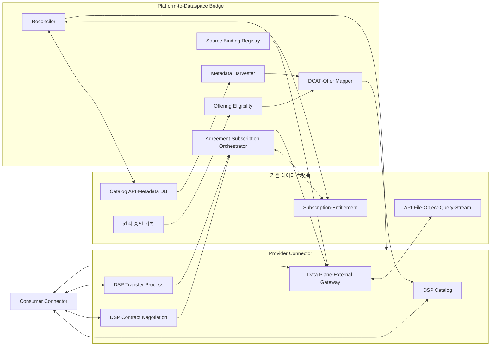

# 기존 플랫폼과 Connector 사이의 Bridge

작성일: 2026-07-11  
작성 기준: 2026-07-11  
상태: Draft

이 문서는 Bridge의 시스템 경계와 구성요소 책임을 정한다. Offering 상태와 전이는 [Offering 온보딩과 접근 수명주기](offering-onboarding-lifecycle.md), southbound request·response 필드는 [플랫폼 인터페이스 계약](platform-interface-contract.md)을 정본으로 사용한다. 조사 선택지와 사례 근거는 [기존 플랫폼 연계 패턴](../01-research/existing-platform-integration-patterns.md)에 둔다.

## 1. 목적과 범위

이 프로젝트는 기존 플랫폼의 데이터와 운영 절차를 재구축하지 않는다. Platform-to-Dataspace Bridge는 기존 기능을 DSP Offering, 계약과 전송 절차에 연결한다.

- 기존 플랫폼은 데이터셋 ID, metadata, 파일·API와 구독 절차를 계속 관리한다.
- Bridge는 호출량 제한, 접근권한과 장애 상태를 DSP 처리에 연결한다.
- 이 문서는 Bridge의 구성요소, 책임 경계, 배치 선택지와 통합 수준을 정의한다.

이 문서에서는 그 경계를 `Platform-to-Dataspace Bridge`로 부른다. Bridge는 독립 제품일 수도 있고 Connector 확장 모듈, 플랫폼 내부 서비스, Connector-as-a-Service(CaaS)의 부가 기능일 수도 있다. 배치와 무관하게 다음 두 조건을 만족해야 한다.

1. 기존 플랫폼이 system of record로 남는다.
2. 데이터 스페이스에서 체결한 계약과 기존 플랫폼의 실제 접근권한이 같은 수명주기로 움직인다.

규격과 프로젝트 결정을 다음과 같이 구분한다.

- **(규격)** DSP는 Catalog, Contract Negotiation과 Transfer Process의 메시지와 상태를 규정한다.
- **(규격 외)** 데이터베이스, Object Storage와 기존 구독 API를 읽는 방법은 DSP 범위가 아니다.
- **(프로젝트 결정)** 플랫폼은 Bridge를 통해 Provider Participant의 Offering과 접근 수명주기에 연결한다.
- **(근거)** `SRC-TECH-001`

## 2. 역할 분리

한 기관이 여러 역할을 맡을 수 있지만 역할 자체를 합치면 권리와 장애 책임을 추적하기 어렵다.

| 역할 | 하는 일 | 같은 역할로 간주하면 안 되는 대상 |
| --- | --- | --- |
| 원 데이터 보유기관 | 데이터 생성·보유와 법적 제공 판단 | Connector 운영자 |
| Publisher·Steward | 메타데이터·품질·변경 관리 | DSP 계약 당사자 |
| 기존 플랫폼 운영자 | Dataset과 delivery path를 `hosted`, `brokered`, `index-only` 또는 `unknown`으로 운영·관리 | 데이터 스페이스 운영자 |
| Offering Provider Participant | DSP Offer를 제시하고 Agreement 당사자가 됨 | 원 생산기관과 항상 같지는 않음 |
| Connector 운영자 | DSP endpoint, 상태 저장, 정책 평가 운영 | Offering 제공권한자 |
| Data Delivery Operator | API·파일·stream·gateway로 payload 전달 | Catalog Broker |
| 데이터 스페이스 운영자 | 참가자 신뢰, 공통 규칙, 검색·지원 운영 | 개별 Dataset Provider |
| Catalog Broker | 여러 Provider Catalog의 Offering을 모아 검색시킴 | Offering을 새로 만들 권한이 자동으로 생기지 않음 |

플랫폼 측 Participant는 적법한 `hosted` 또는 `brokered` 역할과 구독 관리 권한이 확인된 Dataset에서 Offering Provider가 될 수 있다.

- 통합채널이 원천 URL만 색인한 Dataset은 통합채널 metadata만으로 DSP Agreement와 전송을 만들지 않는다.
- 네 역할 값은 같은 Dataset과 delivery path에서 상호 배타적이다.
- 플랫폼 전체에는 서로 다른 역할의 delivery path가 함께 있을 수 있다.

## 3. 시스템 경계

Bridge에는 세 방향의 인터페이스가 있다.

| 방향 | 인터페이스 | 예시 |
| --- | --- | --- |
| Northbound | 데이터 스페이스 참가자와 교환 | DSP Catalog, Contract Negotiation, Transfer Process |
| Southbound | 기존 플랫폼 기능 사용 | metadata export, source API, subscription·token API |
| Management | 운영·승인·감사 | Offering 승인, 재동기화, secret, 상태 조회, audit export |

## 4. Bridge의 구성요소

### 4.1 Metadata Harvester

플랫폼에서 baseline과 변경분을 읽는다. 안정적인 ID, 수정시각, 삭제표시, pagination과 schema version이 필요하다.

로그인 단일 페이지 애플리케이션(Single-Page Application, SPA)이 호출하는 내부 API는 바로 운영 source로 사용하지 않는다. 공식 server-to-server 계약과 지원정책을 먼저 확인한다.

### 4.2 Offering Eligibility

검색 결과를 그대로 Offering으로 복사하지 않는다. 다음 조건을 모두 확인한다.

- 데이터셋이 실제 payload 또는 실행 가능한 서비스로 이어진다.
- Offering Provider가 계약과 제공을 수행할 권한이 있다.
- 라이선스·제3자 권리·공개등급이 해당 전달 방식과 맞는다.
- Consumer가 사용할 Distribution과 DataService를 만들 수 있다.
- 수정·삭제·제공중단을 동기화할 수 있다.
- 계약 종료 시 token, subscription, 임시 사본을 회수할 수 있다.

조건을 만족하지 못한 record의 Offering 상태는 `CATALOG_ONLY`로 둔다. 이 상태에서는 discovery metadata만 게시한다.

### 4.3 Offering Mapper

플랫폼 record를 canonical model로 정규화한 뒤 DSP Catalog의 Dataset, Offer, Distribution, DataService로 투영한다. 원천 endpoint와 secret은 public Catalog에 넣지 않고 Source Binding Registry에 둔다.

DataService의 `endpointURL`은 원천 REST API 주소가 아니다. DSP 협상과 Transfer Process를 받는 Offering Provider Connector의 endpoint다. 실제 원천 URL은 Connector 내부 binding으로 해석한다. 근거: `SRC-TECH-001`, `SRC-TECH-002`.

### 4.4 Source Binding Registry

다음 정보를 public metadata와 분리해 보관한다.

- platform ID와 source dataset ID
- source type과 endpoint 또는 object key
- credential reference
- 허용 method·path·query·경계 상자(Bounding Box, BBOX)·format
- 호출량·동시성·timeout
- adapter 또는 external gateway ID
- subscription·entitlement 연계 방식
- schema·version·변환 pipeline

Consumer가 임의의 source URL이나 query template을 전달해 binding을 바꿀 수 없어야 한다.

### 4.5 Agreement·Subscription Orchestrator

DSP Agreement와 Transfer Process의 변화를 플랫폼의 접근권한으로 변환한다.

- Contract Negotiation `FINALIZED` Event의 확인 응답(Acknowledgement, ACK): Agreement scope subscription 또는 entitlement 생성 준비
- Transfer Request Message의 ACK 확인: Transfer scope token, signed URL, export job, 임시 접근제어목록(Access Control List, ACL) 생성
- Transfer Suspension ACK 확인: Transfer scope 접근 중지. Agreement scope 자원은 유지 가능
- Transfer Completion·Termination ACK 확인: 해당 Transfer의 token·job·ACL·임시 object 회수
- local Agreement 만료·철회·해지: 관련 active Transfer 중지와 Agreement scope subscription·entitlement 회수
- 실패: 재시도, 보상 작업, 운영자 경보

DSP 상태와 플랫폼 상태는 이름과 전이 규칙이 다르다. 단순 문자열 치환 대신 [Offering 온보딩과 접근 수명주기](offering-onboarding-lifecycle.md)의 mapping table을 사용한다.

Orchestrator는 Contract Negotiation과 Transfer Process의 각 DSP Message에 대한 ACK 또는 `ERROR`를 처리한다.

- ACK 전에는 목표 상태 전이를 완료한 것으로 처리하지 않는다.
- `ERROR` 응답은 DSP 상태 전이나 플랫폼 provisioning·cleanup을 시작하지 않는다.
- Transfer Request에서는 `consumerPid`, `agreementId`, `format`과 `callbackAddress`를 검증한다.
- Push Transfer Request에서는 `dataAddress`를 추가로 검증한다.
- Transfer Start에서는 `providerPid`와 `consumerPid`를 검증한다.
- Pull Transfer Start에서는 `dataAddress`를 추가로 검증한다.
- 두 메시지의 `@context`와 `@type`도 검증한다.

### 4.6 Reconciler

이벤트 하나를 놓쳐도 최종 상태를 맞추는 주기 작업이다.

- 플랫폼에서 삭제된 데이터가 Catalog에 남아 있는지 확인
- 만료된 Agreement에 활성 subscription이 남아 있는지 확인
- Connector에는 종료됐지만 signed URL이나 stream ACL이 유효한지 확인
- Offering version과 source schema가 어긋났는지 확인
- 재시도 중복으로 subscription이 둘 이상 만들어졌는지 확인

## 5. 통합 수준

### 5.1 Discovery-only

플랫폼 metadata와 landing page만 검색한다. DSP Offer와 실제 접근서비스가 없으므로 Contract Negotiation이나 Transfer Process의 대상이 아니다. 외부 사이트 링크를 Distribution으로 가장하지 않는다.

### 5.2 Offering publication

플랫폼 데이터셋을 DSP Offering으로 게시하지만 실제 데이터는 공개 URL에서 직접 받는다. 공개 라이선스와 안정적인 endpoint가 있고 별도 subscription이 필요하지 않을 때 적합하다. DSP 경로가 기존 공개 접근을 불필요하게 제한해서는 안 된다.

### 5.3 Full lifecycle bridge

DSP 계약을 플랫폼 subscription·entitlement로 변환하고, Transfer scope 자원과 Agreement scope 자원을 각자의 종료조건에 맞춰 회수한다. Mobilithek 연계에서는 계약 체결·종료와 subscription 활성화·삭제의 연동을 확인할 수 있다. 근거: `SRC-CASE-001`, `SRC-CASE-002`.

### 5.4 Compute-to-data

원시 데이터 대신 플랫폼 가까이에서 승인된 작업을 실행하고 결과만 전달한다. DSP 기본 규격은 원격 작업 형식과 실행 격리를 정의하지 않으므로 별도 domain profile, workload identity, network 차단, 결과 반출심사가 필요하다.

## 6. 배치 선택지

| 선택지 | 적합한 상황 | 주요 비용·위험 |
| --- | --- | --- |
| 플랫폼 자체 Connector | 플랫폼 운영자가 Provider와 운영책임을 맡을 수 있음 | Connector 운영역량과 인증 필요 |
| 플랫폼 옆 전용 Bridge+Connector | 기존 플랫폼 변경을 최소화해야 함 | 두 시스템 상태 동기화 필요 |
| CaaS+플랫폼 Adapter | 기관이 Connector를 직접 운영하기 어려움 | CaaS 사업자 신뢰·tenant 격리·egress 검토 |
| 원천기관별 Connector | 플랫폼이 index-only이고 제공권한이 없음 | 기관 수만큼 onboarding·운영 증가 |
| 중앙 Catalog Broker | 이미 존재하는 Provider Offering을 한곳에서 찾게 함 | Provider가 없는 legacy record를 Offering으로 만들지는 못함 |

Catalog Broker와 Platform Bridge는 대체 관계가 아니다. Bridge가 legacy dataset을 Offering으로 만들고, Broker가 그 Offering을 수집할 수 있다.

## 7. 데이터 전달 방식

| 방식 | 데이터 흐름 | 선택 조건 |
| --- | --- | --- |
| Direct pull | Consumer가 플랫폼 또는 gateway의 단기 URL·token 사용 | 원천이 소비자별 권한과 감사 지원 |
| Gateway·proxy | Data Plane 또는 전문 gateway가 source 호출 후 전달 | query 제한·credential 은닉 필요 |
| Materialized snapshot | 요청 시 export 후 임시 object 제공 | 대용량·버전 고정·재현성 필요 |
| Provider push | 플랫폼이 Consumer sink로 전달 | Consumer sink와 보안 profile 합의 |
| Stream subscription | topic·consumer group·ACL을 계약별 생성 | 비종료형 데이터와 quota·replay 필요 |
| Compute-to-data | source 근처에서 작업 후 결과만 전달 | 원시 반출 금지 또는 데이터 규모가 큼 |

DSP에서 `pull`과 `push`는 전송 방향을 나타낸다. `finite`와 `non-finite`는 전송 종료 특성을 나타낸다.

Direct, proxy, snapshot과 stream은 배포 패턴이다. 이 분류를 DSP 전송 방향이나 종료 특성과 같은 용어처럼 사용하지 않는다.

## 8. 국토교통 통합채널 적용 판정

현재 증거로는 통합채널 전체를 Mobilithek와 같은 Provider Gateway로 판정할 수 없다. 검색 record, 원천 landing URL, 활용자료와 분석센터 API가 한 서비스에 함께 존재하기 때문이다. 데이터셋별 판정에는 다음 증거가 필요하다.

1. payload 저장·전송 기능과 운영주체
2. 원 제공자를 대신하는 구독 생성·해지 권한과 API
3. DSP Agreement 계약 당사자의 권한 문서
4. 데이터 스페이스 identity와 플랫폼 권한의 binding 방식
5. 계약 종료 후 platform token·subscription 삭제 결과
6. metadata 수정·비활성화·삭제의 Offering 반영 결과

`1~6`의 근거가 확보된 데이터셋은 full lifecycle bridge 후보가 된다. 실제 source만 있고 구독 기능이 없으면 publication 또는 adapter 연계 후보가 된다. 원천 링크만 있으면 discovery-only로 남긴다.

## 9. 제외 범위

- 기존 플랫폼의 전체 데이터를 새 저장소로 복제하지 않는다.
- 검색 record에 가짜 Offer나 동작하지 않는 Distribution을 붙이지 않는다.
- Connector 운영권을 데이터 제공권한으로 간주하지 않는다.
- DSP Agreement만으로 플랫폼 약관, 법적 제공근거, 보안승인을 대체하지 않는다.
- 공개 API를 이유 없이 proxy 뒤에 숨기거나 새로운 이용제약을 붙이지 않는다.
- 구현 제품의 내부 객체를 DSP 규범으로 설명하지 않는다.

## 10. 관련 문서

- [MDS–Mobilithek 참조 사례](../01-research/mds-mobilithek-reference-case.md)
- [기존 플랫폼 연계 패턴](../01-research/existing-platform-integration-patterns.md)
- [국토교통 통합채널 역량 프로필](../01-research/molit-platform-capability-profile.md)
- [Offering 온보딩과 접근 수명주기](offering-onboarding-lifecycle.md)
- [플랫폼 인터페이스 계약](platform-interface-contract.md)
- [ADR-0003](../adr/0003-existing-platform-integration-topology.md)
