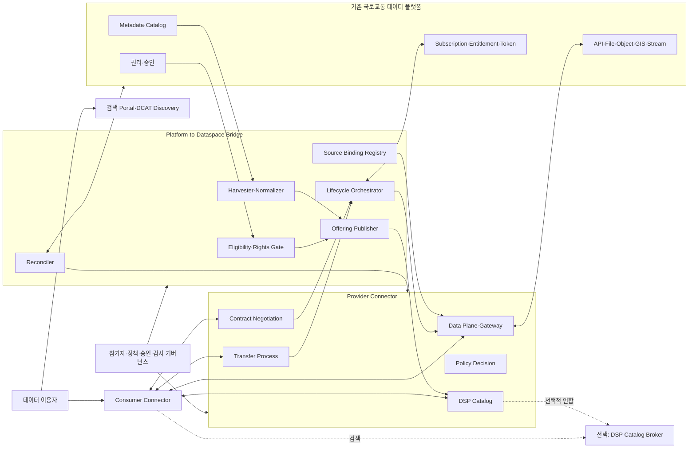
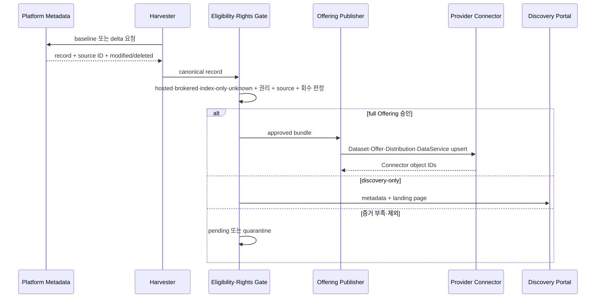
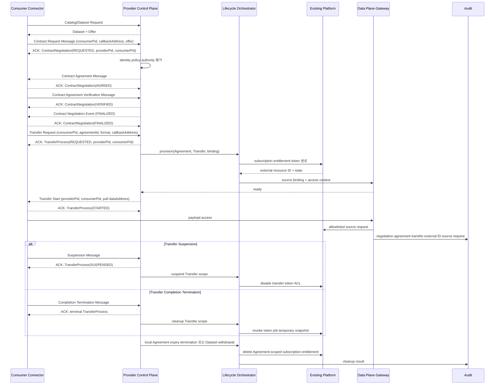

# 목표 아키텍처

작성일: 2026-07-11  
작성 기준: 2026-07-11  
상태: Draft

## 1. 목적·범위와 결정 상태

이 문서는 기존 국토교통 플랫폼을 유지하는 목표 토폴로지와 책임 경계를 정의한다. Bridge 내부 계약과 Offering 상태의 정본은 관련 설계 문서로 분리한다.

확정한 프로젝트 원칙은 두 가지다.

1. 기존 플랫폼과 원천 시스템을 system of record로 유지한다.
2. 플랫폼의 public metadata와 private source binding을 분리한다.

다음 항목은 아직 선택하지 않았다.

- 통합채널이 Provider, Catalog Broker 또는 discovery portal 중 어떤 역할을 맡는가
- 플랫폼 자체 Connector, 별도 Bridge, CaaS, 원천기관별 Connector 중 무엇을 배치하는가
- EDC 또는 다른 Connector 제품을 사용하는가
- identity, transfer profile, public/private network를 어떻게 구성하는가

[ADR-0001](../adr/0001-federated-provider-model.md)의 기관별 Provider 모델은 비교 대상이며 기본 구조로 확정하지 않는다. 기존 플랫폼 연결의 1차 선택지는 [ADR-0003](../adr/0003-existing-platform-integration-topology.md)에 제안한다.

이 문서는 선택한 토폴로지의 전체 구성을 설명한다. Bridge 내부 인터페이스는 [Platform-to-Dataspace Bridge](platform-connector-bridge.md), Offering의 정식 상태 집합과 전이는 [Offering 온보딩과 접근 수명주기](offering-onboarding-lifecycle.md)를 기준으로 한다.

## 2. 설계 원칙

1. 플랫폼 record가 아니라 승인된 Data Offering을 연계 단위로 삼는다.
2. 원 보유기관, 플랫폼 host·broker와 Offering Provider를 구분한다.
3. Connector 운영자, 계약 당사자와 전달 운영자를 구분한다.
4. DSP Catalog, Contract Negotiation, Transfer Process와 플랫폼의 metadata·subscription·payload API 사이에 명시적 Bridge를 둔다.
5. DSP 상태와 Offering 게시 상태, 플랫폼 entitlement 상태를 별도로 저장한다.
6. source endpoint와 credential은 Connector 내부 binding으로 보관한다.
7. 계약 종료와 Dataset 철회는 플랫폼 자원 회수와 reconciliation까지 완료해야 끝난다.
8. Catalog Broker는 이미 존재하는 Provider Offering을 연합한다. legacy record를 Offering으로 만드는 역할과 혼동하지 않는다.
9. 공개 데이터, 기관 제한 데이터, 안전한 분석, 공개제한 공간정보는 서로 다른 전달·보안 경로를 사용한다.

## 3. 전체 구조



Portal에는 `catalog-only` record도 표시할 수 있다. DSP Catalog에는 유효한 Offer, Distribution, DataService와 실제 제공경로를 가진 Dataset만 게시한다.

## 4. 책임 경계

| 구성요소 | 책임 | 책임이 아닌 것 |
| --- | --- | --- |
| 기존 플랫폼 | metadata, source, subscription, quota와 플랫폼 SLA | DSP wire protocol |
| Harvester·Normalizer | baseline·delta·delete, canonical metadata | 계약·재제공 권한의 최종 승인 |
| Eligibility·Rights Gate | `hosted·brokered·index-only·unknown` 판정, 권리·기술 Gate | 법무·보안 승인 대행 |
| Offering Publisher | Dataset·Offer·Distribution·DataService 등록·갱신·철회 | payload 저장 |
| Source Binding Registry | private endpoint·credential ref·허용동작·adapter mapping | public Catalog 제공 |
| Lifecycle Orchestrator | Agreement·Transfer를 entitlement·token·job·ACL로 변환 | DSP 상태를 임의 변경 |
| Reconciler | Connector와 플랫폼 상태 불일치 탐지·복구 | 원천 업무판단 |
| Provider Control Plane | DSP endpoint, policy, negotiation, transfer 상태 | 실제 payload 운반 |
| Data Plane·Gateway | source 접근, 변환, 전달, token·임시자원 | Offer·Agreement 작성 |
| Catalog Broker | 여러 Provider Catalog의 검색·provenance·visibility 보존 | Provider 권한 자동 취득 |
| Governance | 참가자·issuer·profile·승인·제재 기준 | 개별 DSP message 처리 |

## 5. 세 개의 Plane

### 5.1 Data Space Control Plane

```text
DSP version discovery
DSP Catalog
DSP Contract Negotiation
DSP Transfer Process
participant authentication
policy evaluation
```

DataService의 `endpointURL`은 이 Plane의 Provider endpoint다. 원천 REST API나 파일 URL을 넣지 않는다.

### 5.2 Platform Integration Plane

```text
metadata baseline·delta·delete
Offering eligibility and publication
source binding
identity binding
Agreement-to-entitlement orchestration
reconciliation and audit correlation
```

DSP 규격과 기존 플랫폼의 차이를 흡수하는 영역이다. 자세한 구성은 [Platform-to-Dataspace Bridge](platform-connector-bridge.md), 상태 전이는 [Offering 온보딩과 접근 수명주기](offering-onboarding-lifecycle.md)에 정의한다.

### 5.3 Data Plane

```text
direct platform access
external API gateway·proxy
file·object snapshot
provider push
stream subscription
compute-to-data
```

Control Plane은 payload를 직접 전달하지 않는다. Data Plane은 승인된 source binding과 Agreement context만 사용한다.

## 6. Offering 온보딩



DSP Catalog Dataset은 다음 조건을 만족한다.

- 하나 이상의 Offer
- 하나 이상의 Distribution
- 각 Distribution의 DSP `accessService` 하나가 참조하는 Provider DataService
- Provider Connector의 DSP version과 맞는 endpoint
- private source binding과 adapter capability
- 유효한 Offering Provider 권한과 정책

원천 삭제는 누락으로 처리하지 않는다. 신규 협상을 막고 기존 Agreement의 영향을 판단한 뒤 Catalog, token, subscription과 임시 자원을 정리한다.

## 7. 계약·구독·전송

다음은 Consumer pull과 플랫폼 subscription을 함께 사용하는 기준 흐름이다.



도식은 모든 JSON-LD 메시지의 `@context`와 `@type`을 생략했다. Contract Negotiation 상태는 다음 Message와 확인 응답(Acknowledgement, ACK)으로 확정한다.

- Agreement Message와 Consumer ACK 뒤 `AGREED`
- Agreement Verification Message와 Provider ACK 뒤 `VERIFIED`
- Provider의 `FINALIZED` Event와 Consumer ACK 뒤 `FINALIZED`

Provider Control Plane은 Agreement 교환만으로 negotiation을 완료 처리하지 않는다.

Transfer Request는 `consumerPid`, `agreementId`, `format`과 `callbackAddress`를 포함한다.

- Push profile은 sink `dataAddress`를 추가한다.
- Transfer Start는 `providerPid`와 `consumerPid`를 포함한다.
- Pull profile은 접근용 `dataAddress`를 추가한다.
- Consumer는 Distribution ID나 private source binding을 보내지 않는다.

모든 DSP 상태 변경 메시지는 ACK 또는 오류 응답인 `ERROR`를 받는다.

- 송신자는 ACK 뒤 성공 상태를 확정한다.
- `ERROR` 응답은 상태를 바꾸지 않는다.
- ACK 유실 시 송신자는 같은 PID와 같은 의미의 메시지로 멱등 재시도한다.
- 양측 상태를 복구할 수 없으면 terminal process를 되살리지 않는다.
- 구현 검증은 정리 뒤 새 process와 새 PID를 만드는 절차까지 포함한다.

이 그림은 Transfer Request를 provisioning trigger로 사용한다.

- Agreement 시점에 상시 subscription을 생성하는 Dataset은 negotiation의 `FINALIZED` 직후 provision한다.
- 실제 payload 접근은 유효한 Transfer Process에서 시작한다.
- Dataset owner는 선택한 trigger를 Dataset Passport에 기록한다.

Agreement는 Contract Negotiation의 결과 Policy 객체다.

- Data Plane 접근은 negotiation의 `FINALIZED` 뒤 시작한다.
- Transfer의 DSP 상태와 플랫폼 subscription 상태는 별도 enum으로 저장한다.
- Transfer 완료 시 Lifecycle Orchestrator는 해당 Transfer의 단기 자원만 정리한다.
- Local Agreement 만료·철회·해지 또는 Dataset withdrawal 시 장기 subscription·entitlement를 정리한다.
- 외부 자원 생성·삭제 실패 시 Lifecycle Orchestrator는 retry와 보상 작업을 수행한다.
- Reconciler는 외부 자원의 최종 상태와 cleanup evidence를 확인한다.

Provider push에서는 Consumer가 Transfer Request Message에 sink `dataAddress`를 제공한다. Consumer pull에서는 Provider가 Transfer Start Message에 접근용 `dataAddress`를 제공한다. Source Binding Registry의 내부 주소와 이 DSP `dataAddress`는 다른 객체다.

## 8. Catalog Broker의 위치

Catalog Broker는 선택적 구성이다.

```text
Legacy platform record
  -> Platform Bridge가 Offering으로 온보딩
  -> Provider Connector local Catalog
  -> 선택적으로 중앙 Broker가 수집
  -> Consumer가 Provider endpoint에서 협상·전송
```

Broker가 upstream Catalog를 연합하면 visibility, proof 요구와 Offer 의미를 보존한다.

- Broker는 Provider DataService endpoint와 provenance를 보존한다.
- Broker가 Agreement 상대방이 되려면 해당 Dataset의 Offering Provider 역할과 권한 증거를 별도로 가져야 한다.

## 9. 배치 토폴로지

### 9.1 플랫폼 자체 Provider Connector

플랫폼 운영자가 Connector와 Bridge를 운영한다. Mobilithek에 가장 가까운 형태다. host·broker 권한, subscription API와 운영역량이 확인될 때 우선 검토한다.

### 9.2 플랫폼 옆 Bridge와 별도 Connector

기존 플랫폼 변경을 줄이면서 전용 integration service가 metadata와 lifecycle을 연결한다. 운영자는 Connector와 플랫폼 사이의 장애·상태 불일치를 탐지하고 복구해야 한다.

### 9.3 CaaS

플랫폼 또는 Provider가 Connector를 직접 운영하기 어려울 때 사용한다. CaaS tenant가 어떤 Provider를 대리하는지, source credential을 어디에 보관하는지, 국내 망·데이터 반출·감사 조건을 검증한다.

### 9.4 원천기관별 Connector

통합채널이 index-only이고 원 제공기관을 대신할 권한이 없을 때 사용한다. 중앙 통합채널은 discovery 또는 Broker 역할만 맡을 수 있다. 기관별 운영부담이 크므로 모든 기관의 기본안으로 미리 정하지 않는다.

### 9.5 혼합형

hosted·brokered 데이터는 플랫폼 Connector가 제공하고, index-only 데이터는 원천기관 Connector 또는 discovery link로 남긴다. 현재 국토교통 통합채널에 가장 현실적인 조사 가설이지만 데이터셋별 증거가 필요하다.

## 10. Network와 Secret

| 영역 | 배치 대상 | 기본 통제 |
| --- | --- | --- |
| Public edge | DSP public endpoint, consumer-facing gateway | TLS, WAF, rate limit, 최소 endpoint |
| Connector application | Control Plane, policy, Offering store | management API 외부 비공개 |
| Integration | Bridge, adapter, Reconciler | source별 service identity, egress allowlist |
| Platform | metadata·subscription·source API | 공식 server-to-server endpoint, tenant·quota 격리 |
| Security | 제한 데이터·compute-to-data | 별도 승인, 망·단말·반출 통제 |
| Management | Vault·하드웨어 보안 모듈(Hardware Security Module, HSM), audit, monitoring, backup | 강한 관리자 인증, 직무분리 |

다음 credential은 Bridge에서 사용하지 않는다.

- 사람 비밀번호와 session cookie
- 사이트 간 요청 위조(Cross-Site Request Forgery, CSRF) 방어 token과 개인용 API key

private source URL, credential과 token 원문은 Catalog나 callback에 기록하지 않는다. metric label과 일반 log에도 기록하지 않는다.

## 11. 상태 저장과 감사

최소한 다음 연결을 조회할 수 있어야 한다.

```text
source record
  -> canonical Dataset
  -> Connector Dataset·Offer·Distribution
  -> Contract Negotiation consumer/provider PID
  -> Agreement
  -> Transfer consumer/provider PID
  -> platform entitlement·subscription·job
  -> source request
  -> cleanup evidence
```

외부 호출 전에 command와 멱등키를 durable store 또는 transactional outbox에 기록하고, 응답을 받으면 platform external ID를 같은 mapping에 추가한다. payload와 secret을 감사 상관키로 쓰지 않는다.

## 12. 장애 처리

| 장애 | 기대 동작 |
| --- | --- |
| metadata source 장애 | 마지막 정상 Offering에 stale·확인시각 표시, 임의 삭제 금지 |
| platform subscription 생성 실패 | Transfer Start 금지, 제한 재시도·보상·경보 |
| Connector crash 뒤 외부 자원만 생성 | outbox의 멱등키로 상태 조회·재호출 후 external ID를 확정 저장하거나 삭제 |
| source API timeout·quota | 계약별 격리, backoff·circuit breaker, 상태와 원인 기록 |
| schema 변경 | binding quarantine, 신규 Transfer 중지, 기존 Agreement 영향 분석 |
| 종료 callback 유실 | 짧은 TTL·gateway deny, reconciliation이 revoke 재실행 |
| delete API 실패 | 즉시 접근 deny, retry queue와 수동 정리 증거 |
| Broker 장애 | Provider local Catalog 또는 복구 후 cache 재구성 |
| duplicate·out-of-order event | idempotency key와 resource version으로 단일 최종 상태 유지 |

## 13. 국토교통 통합채널 적용 순서

1. Dataset과 delivery path별 `hosted`, `brokered`, `index-only`, `unknown`을 기록한다.
2. `hosted·brokered` 후보에서 Offering Provider와 계약·재제공 권한을 확인한다.
3. metadata baseline·delta·delete, identity, subscription·token API를 확인한다.
4. 실제 플랫폼이 준비되기 전 mock으로 Offering·Agreement·Transfer·revoke를 검증한다.
5. 공개 데이터 한 건을 sandbox에서 종단 연결한다.
6. index-only record는 원천기관 연결 또는 discovery-only 중 하나로 분기한다.
7. Broker는 여러 Provider Offering을 연합할 필요가 확인된 뒤 별도 결정한다.

현재 관찰로 확인된 것과 남은 질문은 [국토교통 통합채널 역량 프로필](../01-research/molit-platform-capability-profile.md)에 기록한다.

## 14. 구현 선택 유보 항목

EDC는 MDS 사례와 확장 구조를 검토할 수 있는 후보지만 DSP가 EDC를 요구하지 않는다. Connector 비교에서는 다음을 실제로 시험한다.

- DSP 2025-1-err1 schema·상태·상호운용
- Offering 등록·수정·철회 Management API
- event·callback·outbox·reconciliation 확장점
- Connector 평가자는 승인된 source fixture로 custom source와 external Data Plane 연계를 실행하고 격리·상호운용 시험 결과를 남긴다.
- CaaS tenant, secret, network와 audit 경계
- 제품 upgrade·migration·backup·지원 수명주기

선택 결과는 별도 ADR에 version과 근거를 고정한다.
