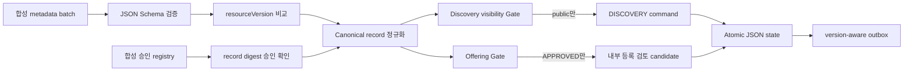

# Discovery Bridge 구현

작성일: 2026-07-11  
작성 기준: 2026-07-11  
상태: Active  
구현 슬라이스: S1

## 1. 목적과 구현 범위

- **(목적)** 기존 플랫폼 metadata를 분류·정규화하고 공개 Discovery와 Connector 등록 검토 대상을 분리하는 실행 가능한 Bridge core 구현
- **(입력)** 운영정보가 아닌 합성 baseline·delta·tombstone과 별도 합성 승인 registry
- **(출력)** 공개 가능 Discovery command, 내부 전용 Connector 등록 검토 candidate, source mapping과 sync report
- **(미구현)** 운영 플랫폼 adapter, DSP Connector, ODRL Offer, Contract Negotiation, Transfer Process, Data Plane과 entitlement

국토교통 통합채널의 운영용 metadata hostname, stable ID, delta·delete와 server-to-server 인증은 확인되지 않았다. S1은 확인되지 않은 endpoint를 추정해 호출하지 않는다. [기존 플랫폼 인터페이스 계약](../02-architecture/platform-interface-contract.md)의 metadata 의미를 합성 fixture로 먼저 고정한다.

`APPROVED`는 합성 승인 registry와 기술 Gate를 통과했다는 프로젝트 내부 상태다. 생성된 candidate에는 `automaticDispatchAllowed=false`와 `routing=internal-review-only`를 기록한다. DSP Catalog의 `PUBLISHED` 상태가 아니며 Connector 자동등록에 사용할 수 없다.

## 2. 처리 흐름



원천 record 안의 `providerAuthority`, `transferDecision`과 evidence ID만으로 승격하지 않는다. 별도 approval registry가 동일한 source system, record ID, resource version과 record digest를 승인해야 한다.

## 3. 코드와 계약

| 경로 | 책임 |
| --- | --- |
| [`contracts/platform-metadata-batch.v1.schema.json`](../../contracts/platform-metadata-batch.v1.schema.json) | baseline·delta·tombstone 입력 Schema |
| [`contracts/approval-registry.v1.schema.json`](../../contracts/approval-registry.v1.schema.json) | 합성 승인과 공개범위 입력 Schema |
| [`contracts/projection-config.v1.schema.json`](../../contracts/projection-config.v1.schema.json) | identifier namespace와 Connector endpoint 설정 Schema |
| [`contracts/discovery-record.v1.schema.json`](../../contracts/discovery-record.v1.schema.json) | 공개 Discovery projection 출력 Schema |
| [`contracts/connector-registration-candidate.v1.schema.json`](../../contracts/connector-registration-candidate.v1.schema.json) | 내부 등록 검토 candidate 출력 Schema |
| [`contracts/outbox-envelope.v2.schema.json`](../../contracts/outbox-envelope.v2.schema.json) | 승인 Gate·합성 trust·자동 dispatch 차단 envelope |
| [`src/discovery/schema-validator.mjs`](../../src/discovery/schema-validator.mjs) | Ajv 기반 executable Schema validation |
| [`src/discovery/approval-registry.mjs`](../../src/discovery/approval-registry.mjs) | source record digest와 합성 승인 결합 |
| [`src/discovery/validation.mjs`](../../src/discovery/validation.mjs) | 식별자·시각·HTTPS·크기·credential-like 값 검증 |
| [`src/discovery/model.mjs`](../../src/discovery/model.mjs) | canonical record와 Offering·Discovery 판정 |
| [`src/discovery/projection.mjs`](../../src/discovery/projection.mjs) | 공개 Discovery와 DCAT 지향 등록 초안 생성 |
| [`src/discovery/synchronizer.mjs`](../../src/discovery/synchronizer.mjs) | version·멱등·철회·재투영·outbox 처리 |
| [`src/discovery/state-repository.mjs`](../../src/discovery/state-repository.mjs) | single-writer lock과 atomic JSON 저장 |
| [`src/cli.mjs`](../../src/cli.mjs) | `sync`·`review`·`inspect` 명령 |
| [`fixtures/discovery/`](../../fixtures/discovery/) | 운영자료가 아닌 합성 batch·승인·설정 |
| [`tests/`](../../tests/) | 단위·Schema contract·통합시험 |

Node.js 24 ESM을 사용한다. JSON Schema 2020-12 검증에는 고정 version의 Ajv와 `ajv-formats`를 사용한다.

## 4. 입력 계약

### 4.1 Batch envelope

| 필드 | 규칙 |
| --- | --- |
| `schemaVersion` | `molit.platform-metadata-batch/1` 고정 |
| `batchId` | NFKC 정규화된 batch 식별자 |
| `sourceSystemId` | 원천 플랫폼 식별자 |
| `mode` | `baseline` 또는 `delta` |
| `observedAt` | 실제 달력까지 확인한 RFC 3339 시각 |
| `records` | 최대 10,000개의 upsert·delete event |

### 4.2 Event envelope

| 필드 | 규칙 |
| --- | --- |
| `eventId` | source system 안에서 재전송 때 유지되는 식별자 |
| `eventType` | `record.upsert` 또는 `record.deleted` |
| `recordId` | source system 안에서 안정적인 식별자 |
| `resourceVersion` | 최대 64자리의 비교 가능한 10진 정수 문자열 |
| `occurredAt` | RFC 3339 event 발생시각 |
| `record` | upsert에만 존재하고 delete에는 금지 |

식별자는 trim 결과를 대신 저장하지 않는다. 원문이 NFKC·공백·문자규칙을 통과하지 못하면 batch를 거부한다. state key, Discovery ID와 candidate URN은 같은 canonical tuple encoding을 사용한다.

source `observedAt`과 event `occurredAt`은 감사 provenance다. 승인 효력은 source 시각이 아니라 trusted processing clock으로 평가한다. source 시각이 processing·observation 시각보다 5분 넘게 앞서면 batch를 거부한다.

S1은 JSON Schema와 credential-like 검사에 실패한 batch 전체를 적용하지 않는다. 일부 record만 적용하지 않으므로 정상 record도 함께 재시도된다. Bulk adapter는 batch를 작게 나누고 S2에서 record별 quarantine·dead-letter 정책을 별도로 결정한다.

### 4.3 Record와 Distribution

모든 record는 다음 값을 가진다.

- `recordType`: `dataset`·`organization`·`system`·`use-case`·`post`
- `title`, `description`, `publisher`
- query와 fragment가 없는 HTTPS `landingPage`
- RFC 3339 `issuedAt`, `modifiedAt`
- `keywords`, absolute IRI `themes`, `evidenceIds`

Dataset record는 권리·역할·전달 후보를 추가할 수 있다. 미확인 항목은 누락할 수 있으며 Offering Gate에서 `PENDING_EVIDENCE`로 판정한다.

- `accessRights`, `license` 또는 `rights`
- `platformRecordRole`
- Provider·Connector·계약·전달 운영자
- `providerAuthority`, `transferDecision`, `policyRef`
- `distributions`

Distribution은 실제 데이터 format과 DSP Transfer의 selector 후보를 구분한다.

| 필드 | 의미 |
| --- | --- |
| `format` | CSV·JSON 등 데이터 형식 |
| `mediaType` | 검증된 IANA media type IRI |
| `transferFormat` | `(Dataset, DSP format)` binding을 찾는 프로젝트 내부 selector |
| `sourceBindingRef` | URL·credential 값이 아닌 registry key |
| `lifecycleMode` | `none·manual·token·entitlement·subscription·job` |
| `revocationMode` | 관리형 접근자원의 회수방법 |

### 4.4 합성 승인 registry

[`approvals.json`](../../fixtures/discovery/approvals.json)은 원천 metadata와 거버넌스 결정을 분리한다.

| 필드 | 판정 용도 |
| --- | --- |
| `trustMode` | S1에서는 `synthetic-test-only`만 허용 |
| source·record·version | 승인 대상을 정확히 지정 |
| `recordDigest` | source record 전체의 SHA-256 digest 고정 |
| `catalogVisibility` | `public·qualified·internal·hidden` 중 하나 |
| `offeringDecision` | `approved·pending·denied` 중 하나 |
| `approvedAt`, `validUntil` | 승인 효력기간 |
| `approvalId`, `approverId`, `evidenceIds` | 합성 승인 추적 |

record 내용이 한 글자라도 바뀌면 digest가 달라진다. 새 version과 승인 entry가 없으면 `unverified`로 돌아가며 공개 Discovery와 등록 검토 candidate를 만들지 않는다.

합성 registry는 실제 전자서명·발급기관·법적 권한을 검증하지 않는다. 운영 adapter는 별도의 서명된 governance registry와 evidence resolver가 준비되기 전까지 추가하지 않는다.

## 5. 판정 Gate

### 5.1 Offering Gate

| 조건 | 판정 | 내부 등록 검토 candidate |
| --- | --- | --- |
| 비-Dataset | `CATALOG_ONLY` | 생성 금지 |
| `platformRecordRole=index-only` | `CATALOG_ONLY` | 생성 금지 |
| `accessRights=excluded` | `QUARANTINED` | 생성 금지 |
| registered·restricted·secure | `PENDING_EVIDENCE` | S1 생성 금지 |
| 합성 승인 누락·digest 불일치·만료 | `PENDING_EVIDENCE` | 생성 금지 |
| Provider·권리·Distribution·회수 증거 부족 | `PENDING_EVIDENCE` | 생성 금지 |
| 형식·Schema·reference 오류 | batch 거부 또는 `QUARANTINED` | 생성 금지 |
| 모든 open·public·합성 승인·기술 Gate 통과 | `APPROVED` | 내부 검토 candidate 생성 |

`APPROVED`의 기술조건은 다음과 같다.

1. 원 보유기관과 Offering Provider Participant 식별
2. Connector·계약·전달 운영자 식별
3. Provider 권한 evidence와 license 또는 rights statement
4. `approved` transfer decision과 policy registry reference
5. 한 개 이상의 Distribution
6. Distribution별 format, media type, evidence와 opaque source binding reference
7. Dataset 안에서 중복되지 않는 `transferFormat`
8. 관리형 lifecycle 자원의 revoke 방식

### 5.2 Discovery visibility Gate

공개 Discovery command는 Offering 상태와 별도로 판정한다.

- approval registry의 record digest 일치
- 유효한 `verified-synthetic` 승인
- `catalogVisibility=public`
- Dataset이면 `accessRights=open`
- `QUARANTINED` 상태 아님

`qualified·internal·hidden`과 registered·restricted·secure Dataset은 `DISCOVERY_UPSERT`를 만들지 않는다. S1에는 자격별 Catalog filter가 없으므로 제한 metadata를 최소 projection으로 공개하지도 않는다.

## 6. 동기화와 상태

### 6.1 중복·역순·종결

- 같은 source의 같은 `eventId`와 내용은 duplicate로 기록
- 같은 `eventId`의 다른 내용은 `EVENT_ID_CONFLICT`
- 현재보다 작은 `resourceVersion`은 stale로 기록
- 같은 version의 다른 내용은 `RESOURCE_VERSION_CONFLICT`
- baseline 누락은 삭제로 처리하지 않음
- delete는 명시적 `record.deleted` tombstone으로만 처리
- `WITHDRAWN`은 terminal이며 같은 `recordId`의 재등록 금지

철회한 데이터가 다시 생기면 새 incarnation을 나타내는 source record ID와 새 승인을 사용한다.

### 6.2 설정·승인 변경

state는 projection config와 approval registry의 digest를 따로 저장한다.

- Connector endpoint·namespace·service ID 변경 시 기존 canonical record 재투영
- Dataset ID가 바뀌면 이전 ID와 새 candidate를 한 replacement review command로 결합
- approval registry 변경·만료 시 stored record의 공개범위와 Offering Gate 재판정
- 승인이 철회되면 Discovery delete와 Connector review withdraw 생성

같은 metadata event를 다시 보내지 않아도 빈 delta batch로 설정·승인 변경을 적용할 수 있다.

### 6.3 Outbox

| Family | Payload | Routing |
| --- | --- | --- |
| `discovery` | 공개범위로 판정된 합성 Discovery projection 또는 delete | synthetic-discovery-review-only |
| `connector-review` | public draft와 private binding reference를 묶은 검토자료 | internal-review-only |

모든 outbox envelope에는 `trustMode=synthetic-test-only`와 `automaticDispatchAllowed=false`를 기록한다. 같은 aggregate·family에서는 최신 command 하나만 `pending`으로 유지한다. 이전 미처리 command는 `superseded`로 바꾼다.

upsert와 Connector review envelope에는 `approvalGate`를 붙인다. Gate에는 approval·registry·원천 record·projection config의 digest를 기록한다. 효력기간과 payload digest도 Gate에 포함한다.

`reviewPendingOutboxEvents()`는 현재 registry와 config의 digest가 state와 같을 때만 검토 목록을 만든다. trusted review clock으로 approval을 다시 판정한다.

승인된 원천 snapshot에서 canonical record와 projection을 다시 생성한다. 생성 결과를 현재 aggregate·version·payload와 비교한다.

sync 뒤 승인이 만료되면 해당 command는 `blocked`로 분류하고 `reconciliationRequired=true`를 반환한다. empty delta를 실행하면 기존 upsert·review가 supersede된다.

이때 delete·withdraw 검토 command가 최신 pending이 된다. 두 command도 현재 source scope와 resource version이 맞아야 검토할 수 있다.

withdraw에는 해당 record에서 생성했던 candidate Dataset ID를 최대 50개까지 넣는다. 미적용·부분적용 상태는 이 목록과 Connector 현재 상태를 대조해 확인한다.

이 목록은 Connector에 실제 적용된 자원 ledger가 아니다. 외부 실행 기능을 추가할 때는 review ACK 뒤 applied ID를 별도 저장하고 Connector 현재 상태와 대조해야 한다.

sync report의 `outboxEventIds`에는 batch 종료 시점에도 `pending`인 command만 기록한다. report 파일 자체를 queue로 사용하지 않는다.

review assessment에는 `executionAuthority=none`, state·registry·config digest를 기록한다. assessment 생성 뒤 새 sync가 수행되면 이전 파일은 stale할 수 있다.

assessment를 side effect 입력으로 사용하지 않는다. dispatcher 단계에서 atomic claim과 digest compare-and-swap을 구현해야 한다.

Connector review payload는 public publisher가 소비하면 안 된다. dispatcher를 추가할 때 public Catalog command와 private registration command를 별도 topic·credential·store로 다시 분리한다.

### 6.4 State store

state Schema는 `molit.discovery-state/8`이다. 이전 개발용 state는 자동 이관하지 않고 `INVALID_STATE`로 거부한다. 합성 실행 상태는 `.local`을 지운 뒤 다시 만든다.

| 영역 | 내용 |
| --- | --- |
| `records` | 승인 digest와 대조할 원천 snapshot, canonical record, 판정과 projection |
| `processedEvents` | source-scoped event digest와 처리 결과 |
| `outbox` | occurrence sequence, pending·superseded command와 resource version |
| config·approval digest | 재투영과 재판정 기준 |
| `lastEvaluationAt` | sync processing clock의 단조 증가 기준 |
| `lastReviewAt` | review clock rollback을 막는 저장 watermark |

CLI는 state load부터 save까지 `.lock`으로 single writer를 강제한다. stale lock은 자동 삭제하지 않는다. 운영자가 기록된 PID·host와 실행 중 process를 확인한 뒤 수동으로 복구한다. 저장기는 임시 파일을 쓰고 rename하며 실패한 임시 파일은 정리한다.

POSIX에서는 파일 생성 mode `0600`을 요청한다. Windows의 Node.js `mode` option은 접근제어목록을 설정하지 않으므로 상위 directory 권한을 별도로 확인해야 한다.

state·report·input 경로는 가장 가까운 기존 ancestor의 실제 경로로 환산한다. 아직 없는 중간 directory 아래의 junction·symbolic link alias도 같은 target으로 판정한다.

reserved lock 경로에도 같은 판정을 적용한다. state commit 직전과 report 기록 직전에 다시 검사한다.

report도 같은 directory의 임시 파일을 rename해 교체한다. state commit 뒤 report 기록이 실패하면 stdout에 sync report를 남긴다.

오류에는 `REPORT_WRITE_FAILED_AFTER_STATE_COMMIT`, `stateCommitted=true`, 종료 code 3을 기록한다. 이 경우 동일 batch를 다시 sync하지 말고 stdout 결과와 state를 기준으로 report를 복구한다.

review도 watermark를 state에 저장한다. review report 기록이 실패하면 `REVIEW_REPORT_WRITE_FAILED_AFTER_STATE_COMMIT`와 종료 code 3을 반환한다. 다음 review는 저장된 시각보다 이른 clock을 거부한다.

파일과 directory를 `fsync`하지 않으므로 전원 손실까지 견디는 durability는 주장하지 않는다. 운영 단계에서는 state와 report를 하나의 database transaction 또는 recovery journal로 묶는다.

각 원천 snapshot과 canonical record는 SHA-256 digest를 함께 저장한다. load·reconcile·save 때 내용 일치를 확인한다.

outbox map key와 event ID도 envelope content에서 다시 계산한다. active review payload는 승인된 원천 snapshot에서 다시 생성한다.

이 검사는 우발적 손상과 일부 파생값 변조를 탐지한다. 파일 쓰기 권한을 가진 공격자가 state 전체를 다시 구성하는 행위는 막지 못하며 HMAC·전자서명을 대신하지 않는다.

- 입력 JSON 파일 상한: 32 MiB
- state 파일 상한: 64 MiB
- state record 상한: 100,000건
- processed event 상한: 250,000건
- outbox 상한: 200,000건
- aggregate·family별 superseded command 보존: 최근 5건

상한에 도달하면 처리량을 늘리지 않고 `STATE_CAPACITY_EXCEEDED`로 중단한다. 운영 수명주기 전에는 transactional database로 교체한다.

sync 시작 전에는 현재 state byte와 batch byte의 8배를 합산한 보수적 admission estimate를 적용한다. save 직전에는 실제 직렬화 byte를 다시 확인한다.

## 7. 공개·비공개 projection

### 7.1 Discovery projection

`DISCOVERY_UPSERT`에는 공개범위 판정을 통과한 합성 field만 넣는다. payload에도 `syntheticOnly=true`와 `automaticDispatchAllowed=false`를 기록한다.

- source system·record ID와 deterministic Discovery URN
- record type, title, description, publisher
- landing page, issued·modified 시각
- keyword·theme
- `catalogVisibility=public`, Dataset access rights
- 플랫폼 역할과 Offering 판정 결과

source binding, policy reference, Provider authority와 운영자 내부 ID는 넣지 않는다.

### 7.2 Connector 등록 검토 candidate

`catalogProjection`은 Dataset, Distribution과 Provider DataService를 `@graph`로 묶은 DCAT 지향 초안이다.

- DataService `endpointURL`은 allowlist에 있는 Provider Connector hostname만 사용
- source API·file URL과 credential 미포함
- `profileStatus=project-draft-not-dsp-wire-message` 표시
- ODRL Offer와 DSP Catalog wire message 미생성

`registration`은 Provider 역할, 합성 approval reference, policy reference와 `sourceBindingRef`를 가진다. 이 객체는 내부 검토 전용이며 자동 dispatch가 금지된다.

`sourceBindingRef`는 strict registry key grammar를 사용한다. `..`, encoded path, query, fragment와 user information은 허용하지 않는다.

raw HTTP URL도 허용하지 않는다. 향후 resolver는 exact map lookup만 사용하며 filesystem path나 URL 문자열을 이어 붙이지 않는다.

## 8. 실행

### 8.1 초기화

```powershell
Remove-Item -Recurse -Force .local -ErrorAction SilentlyContinue
```

`.local`에는 합성 PoC 상태만 둔다. 운영 credential, browser session과 원시 응답은 넣지 않는다.

### 8.2 Baseline과 delta

```powershell
npm run bridge:sync:baseline
npm run bridge:sync:delta
npm run bridge:review
npm run bridge:inspect
```

Baseline의 예상 판정은 다음과 같다.

| Record | Offering 판정 | Discovery |
| --- | --- | --- |
| 합성 표준 노드·링크 스냅숏 | `APPROVED` | public upsert |
| 외부 교통정보 위치 색인 | `CATALOG_ONLY` | public upsert |
| 합성 교통연구기관 | `CATALOG_ONLY` | public upsert |
| 제공역할 미확인 교통 API | `PENDING_EVIDENCE` | internal only |

Delta는 Dataset v2 갱신, 뒤늦게 도착한 v1 무시, 명시적 tombstone과 비-Dataset 게시물 분류를 시험한다.

`bridge:review`는 pending command를 실행하지 않는다. `--report`는 필수다. stdout에는 ID·type·count·digest summary만 출력한다. private binding reference가 포함된 전체 assessment는 `.local/review-assessment.json`에 기록한다.

assessment는 실행 승인서나 claim이 아니다. `stateDigest`가 현재 `bridge:inspect` 결과와 다르면 폐기하고 review를 다시 실행한다.

## 9. 시험과 요구사항 추적

```powershell
npm run test:unit
npm run test:contract
npm run test:integration
npm run verify
```

| 시험 ID | 검증 내용 |
| --- | --- |
| `IT-CAT-002` | 비-Dataset과 index-only의 Offering 차단 |
| `IT-CAT-003` | canonical identifier와 source mapping |
| `IT-CAT-005` | update·tombstone·terminal·역순·baseline 누락 |
| `IT-CAT-006` | 플랫폼 역할과 evidence Gate |
| `IT-PLT-001` | source ID·version과 canonical mapping |
| `IT-PLT-002` | Provider·권리·Distribution·binding·회수 Gate |
| `FT-PLT-001` | event 재처리·version 충돌·source-scoped ledger |
| `ST-POL-001~003` | 공개범위, 별도 approval registry와 검토 직전 재검증 |
| `ST-SEC-001~002` | credential-like 입력, public/private 경계와 path alias |
| `ST-BIND-001` | opaque binding과 public projection 분리 |
| `ST-AUD-001~002` | RFC 3339, 복잡도와 state·approval Gate 변조 탐지 |
| `NFR-REL-001·003` | outbox supersede, atomic state와 lock 복구 |
| `NFR-OPS-001` | config 변경 재투영 |
| `CT-SCHEMA-001~005` | 입력·승인·설정·candidate·outbox executable Schema |

`FR-CAT-001`의 공식 export·API 수집은 충족하지 않았다. S1은 adapter 입력 계약만 구현했으며 실제 운영 endpoint 상태는 `blocked-live`다.

## 10. 보안 경계와 제한

- 합성 승인 registry는 실제 서명·issuer·법적 권한을 검증하지 않는다.
- secret pattern 검사는 흔한 credential 표현을 차단하는 보조통제다. 임의 secret 검출을 보장하지 않는다.
- 공개 projection은 별도 digest approval을 요구하며 승인되지 않은 원천 변경을 공개하지 않는다.
- S1의 landing page, license, theme과 Connector endpoint는 reserved `.invalid` hostname만 허용한다. media type은 IANA URI만 허용한다.
- S1에는 outbound HTTP가 없다. 향후 fetch adapter는 현재 URL validator를 SSRF 방어로 재사용하지 않는다.
- review 조회 때도 approval 효력기간과 현재 registry·config를 다시 확인한다. 정기 scheduler는 없으므로 만료 command가 `blocked`이면 empty delta를 실행해야 한다.
- S2에서는 reconciliation schedule과 side effect 직전 atomic claim·재검증을 추가한다.
- successful sync와 review의 clock watermark를 state에 저장하고 뒤로 이동하면 fail-closed 처리한다. 큰 forward jump는 이후 처리를 막을 수 있으므로 운영 단계에서 secure time source와 승인된 recovery 절차가 필요하다.
- source event에는 서명·service identity binding이 없다. 운영 ingest 전에 mTLS identity, sourceSystemId와 delete 권한을 결합해야 한다.
- local JSON store는 single-host PoC용이며 database transaction·backup·encryption을 제공하지 않는다.
- state digest는 keyed integrity가 아니다. 운영 store에는 제한된 database writer, immutable raw record와 append-only audit가 필요하다.
- `discoveryWasProjected`와 candidate ID history는 local state marker다. 과거 적용 사실의 증거가 아니며 수동 delete·withdraw 근거로 사용하지 않는다.
- 운영 단계에서는 publication·applied resource 이력을 승인 원천, 당시 config와 Connector ACK에 연결한 append-only ledger가 필요하다.
- Connector review candidate와 원천 snapshot은 public·private 내용을 함께 가진 내부 자료다. 자동 publisher와 중앙 stdout log에 full payload를 보내지 않는다.
- Windows에서는 file mode를 비밀성 통제로 사용하지 않는다. 운영자료를 쓰기 전에 전용 directory 접근제어목록과 암호화를 적용해야 한다.
- assessment는 queue claim이 아니다. 운영 side effect 직전에 current state·registry·config·clock을 다시 확인해야 한다.
- DCAT-AP 3.0.1 기반 SHACL은 별도 0.1.0 package로 구현했지만 S1 candidate projection에는 연결하지 않았다.
- ODRL Profile, DSP schema와 TCK 검증은 Connector Spike에 남아 있다.
- Agreement·Transfer·entitlement·token·snapshot과 외부 자원 reconciliation은 구현하지 않았다.

## 11. 다음 구현 슬라이스

1. **(S2 Southbound mock)** metadata HTTP source, entitlement create·read·delete, token revoke와 audit query 구현
2. **(S3 Connector Spike)** EDC와 독립 구현 후보의 DSP 2025-1-err1, Management API와 provisioning hook 비교
3. **(S4 Full Lifecycle)** Agreement·Transfer event를 mock entitlement와 연결하고 transactional outbox·회수 시험
4. **(S5 Sandbox adapter)** 서명된 운영 approval, service identity와 공식 HTTPS schema로 input adapter 교체

S2에서도 실제 국토교통 통합채널 API를 추정해 호출하지 않는다. 운영기관이 stable ID, delta·delete, server-to-server 인증과 지원 endpoint를 확인한 뒤 sandbox adapter를 추가한다.
